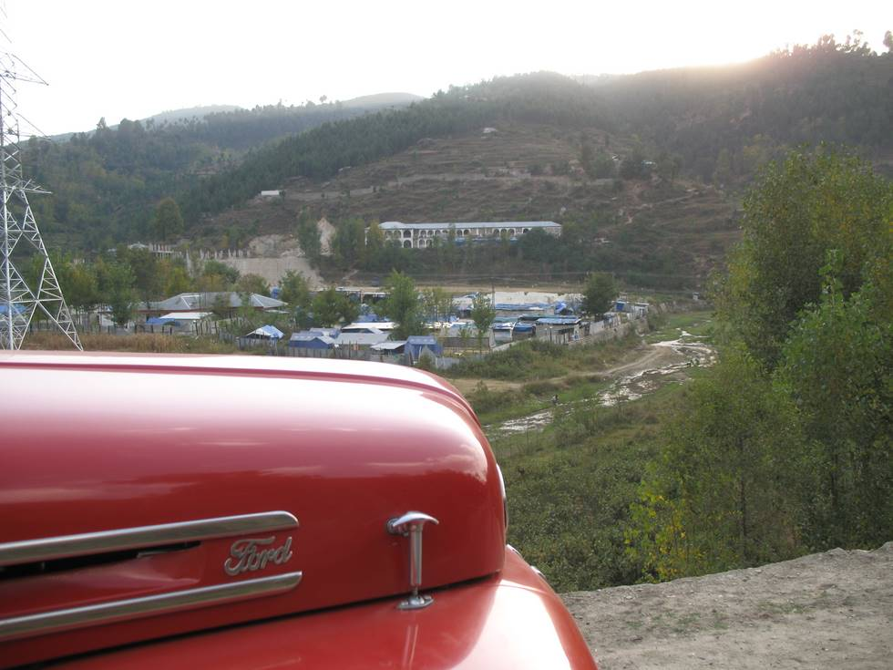

All is still not back to normal in the area since the 2005 earthquake.

## Comments (3)

**Hidayat** - June  5, 2008  5:48 PM

It is the area of the Govt Degree College For Boys Battagram. It is in Village Chappargram.

---

**mohammad abid** - July 27, 2009  4:29 PM

i well see your village chappargram photo i like it so very nice.i like the kohistani tribe introdaction now(caled(bahram khail) thank you somatch
i proude of you.mohammad abid khan khadderkhani jeddah ksa
cel.no.00966501835465
cel.no.00966568886342
email.abidkhanuza@yahoo.com
gmail.abidkhanuza@gmail.com

---

**Randy Salomon** - September 20, 2009 12:24 PM

I am the Chief Engineer for the reconstruction of the new Government Degree College shown in the far left background of the picture (RCC columns). We belong to the Japan International Cooperation System (JICS) and would like to correct that the tents shown in the
foreground was then a military installation of the Pak Army Engineering Battalion. To date, reconstruction of the new Government Degree College
as well as a new Bridge and Access Road up to KKH had been completed and due to be inaugurated on October 8, 2009.

---

