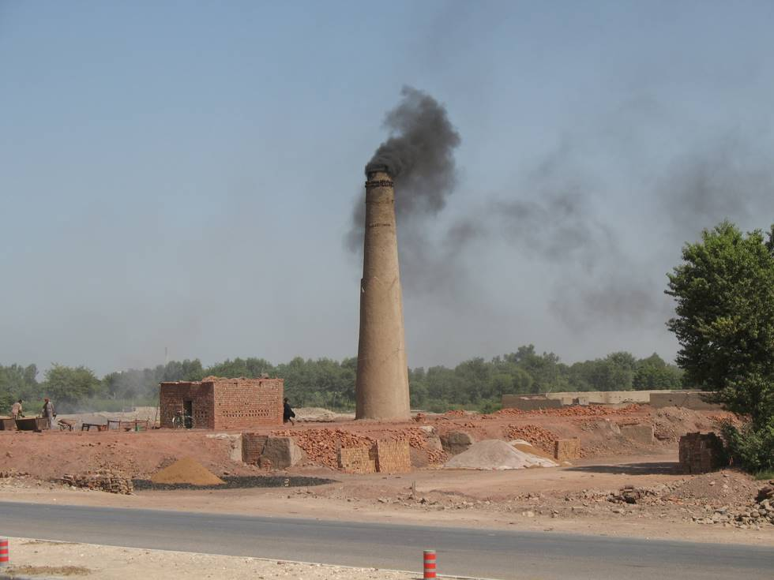

## Comments (1)

**KARAM TALPUR** - December 31, 2008  1:55 PM

THIS LOOKS VERY BEAUTIFUL. THE COUNTRYSIDE OF PAKISTAN IS EXTREMELY BEAUTIFUL, BUT MUCH IGNORED FOR TOURISM PURPOSES. IF ANY TOURISM OFFICER IS READING ATTENTION MUST BE PAID FOR CONSTRUCTION OF SITES, LIKE GORAKH HIIL STATION IN DADU DISTIRCT IN SINDH, THAR DESERT SAFARIS , CULTURAL TOURISM IN INTERIOR SINDH AND LOT MORE.

