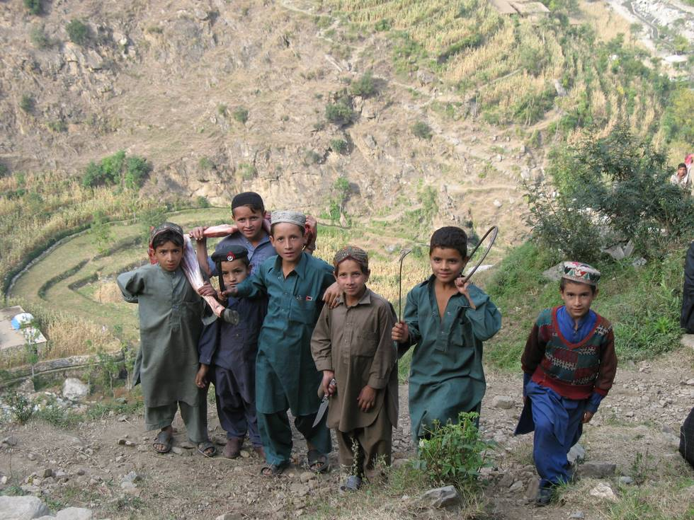

A cow had fallen down the mountainside - the villagers rushed down and salvaged its meat. The children are carrying part of the cow back to their homes.

## Comments (1)

**Kulraj** - April 28, 2012  2:13 PM

Savefiles in \PlantsVsZombies\userdata are not the one used when running on Vista. Had anoyne found the real place where savefiles are stored on Vista? I have searched the computer for files with same name as the one in the userdata-library but could not find any. Could the files have another name???

---

