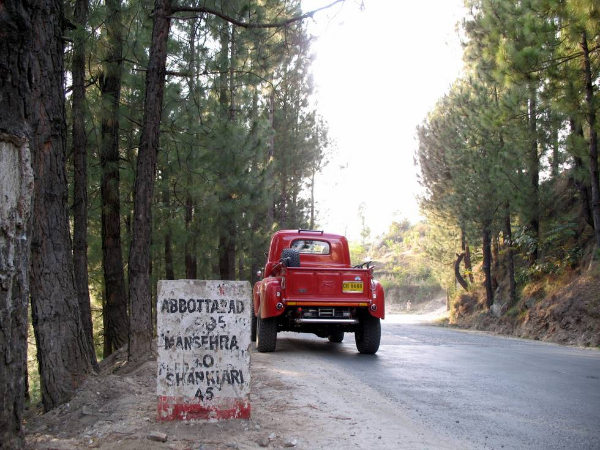

Passing through the scenic Shankiari Valley.

## Comments (1)

**Samantha** - April 28, 2012  3:59 PM

Demo this test is not at all useful as an asemssesnt of marital fitness. The ability to be a good friend is far more fundamental.Angela, don't sweat it. I think I would have preferred it if I scored really low pretty much every woman I know who has taken it (all of whom I admire) has come out with scores between 20 and 40. I have this image of myself as having a very feminist, power-sharing healthy relationship and yet, I ace out on this patriarchal nightmare of a test. What does that mean, exactly? Slarti, I always knew that you didn't wear face cream and rollers to bed.I bet if my husband took the wife test, he too would do well, too although he hasn't praised my strength and masculinity lately.

