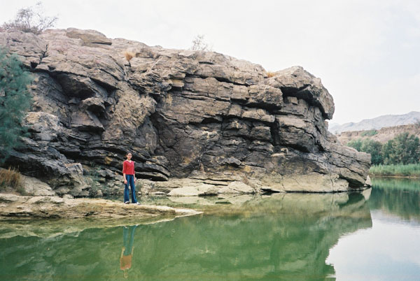

Ayesha at the lake.

## Comments (12)

**Ameena** - June 18, 2003  2:11 AM

If you climb to the top of the hill behind Ayesha, you can see similar terrain as far as the eye can see. It is one of the most beautiful sites.

**Ayesha** - June 18, 2003  3:13 AM

hehe...you guys are funny.

**Khadija Omar** - July 16, 2003 12:01 AM

The lake, the scenery is much more beautifull then what you see in this picture. I would recommend you take this trip. Winter is the time to go there.

**sadaf** - October 15, 2003 11:49 PM

very beautiful!

**tanya mirza** - November  2, 2003  8:46 PM

umm..dude..whose ayesha?????????????

**Aamir** - August  5, 2004  1:50 PM

I love photography and this looks like a dream place to take pictures. Again, beautiful picture.

**Masood Ahmed** - November  8, 2004 12:54 PM

Amazing! Where are these Bhootani farms located? How could we reach them?

**Ahsan Danish** - August  3, 2005  5:58 PM

Looks great place to visit, where is it?

**RadarBlip** - August  6, 2005  2:16 PM

As it is said that this place is to be visited in winters.

So whats the temperature of the water? Will I be able to get a dip? And is the water worth it?

**KO** - August  6, 2005  6:30 PM

The water gets very cold, but you certainly can take a dip.

**Dr.Noor** - February 11, 2006  2:16 PM

Sallam Aysha
hope u will be happy
i m from Sakrand and i want to know that where is this Farm and lake also plz send me address and contact no of the nearest person.
hope ur response will be quick and positive
Dr.Noor
Sakrand

**viram** - July 10, 2006  2:53 PM

I love photography and this looks like a dream place to take pictures. Again, beautiful picture.

