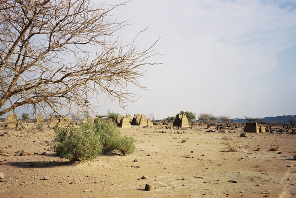

Graveyards on the way to the resort. [More details later.]

## Comments (4)

**susannthomsen** - February 19, 2005  8:51 PM

hi offroaders,
great pictures! thanks a lot for sharing. i used to live in karachi for five years and while looking at these images i'd love to back right away!
take care,
susann

---

**Khalid** - March 21, 2006 10:35 PM

great pictures. thanks for providing so beautiful trip.

---

**Zaim** - June 25, 2006  4:35 AM

Hi all! I am really facinated by what you guys are doing? I am really happy because Pakistanis are generally not into adeventours-Their favorite past time on the weekends is watching third rated Indian Movies and Nahari and that is the recreation they have! I am a Karachite now living in Canada. I love Karachi and what Taimur Mirza and his team is doing and I thank him and
his team for showing what real Pakistan is! Please keep up the good work!
Thank

---

**shamee ghori** - August  2, 2008  8:09 AM

these are very beautiful loctions.please tell me where is this bhootani farm.I need exact location. this website has awoken again my curiosity of going to such places. Shameem ghori

---

