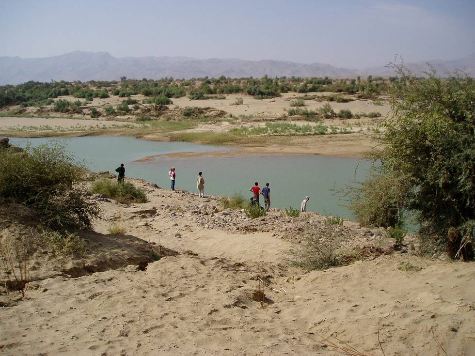

There is only one Jeep in this picture.

## Comments (9)

**Imad** - March 14, 2004 10:02 AM

Is that it near the lower right corner beyond the bushes? Looks to me like a jeep mired in the water.

---

**Yaseen** - April  1, 2004  2:20 PM

its located about 2 inches from the top and 2 1/2 from the left of the picture, below a bush.

---

**KO** - April  1, 2004  5:00 PM

I labelled the picture wrong. There is no Jeep anywhere in this picture.

---

**Yaseen** - April  2, 2004 12:05 AM

trust you to do that!

---

**Aleem** - April  3, 2004 10:42 AM

Khalid - did you loose the Jeep?

---

**KO** - April  3, 2004  3:09 PM

I hope not! It could be that someone left the handbrake off and it rolled into the river... thats why everyone is intently looking at the water for signs of their transport.

---

**Hussain Jaffri** - August 25, 2004 10:00 PM

Good jeep trick driving,raising a lot of dust and getting yourself camouflaged in it.Liked the pictures,keep it up.Next time get a deer closer with your searchlight,its easily possible and beautiful to watch,especially for those who see it for the first time.

---

**sharjeel sheikh** - February 18, 2005 12:19 PM

jeep in the water ...:) finding out...

---

**Asrar Ahmed** - May 26, 2006  5:55 PM

Well! These are wonderful views and landscapes. Have you guys been to Khadeji fall which is in north-east of Karachi on super highway?

---

