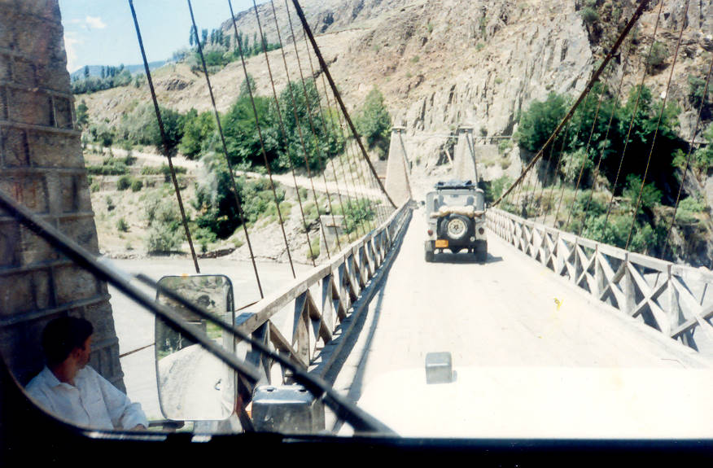

The bridge on the river North. Cars have to cross it one at a time, as this was built by the British almost a century back.

## Comments (2)

**sh. saif ali** - April  8, 2006 12:55 AM

you missed the real deal bridge located in gahiret, which is a sight to see.

**Kashif** - April 16, 2006 12:44 AM

Is it the same bridge which leads to Kallash Valley?

