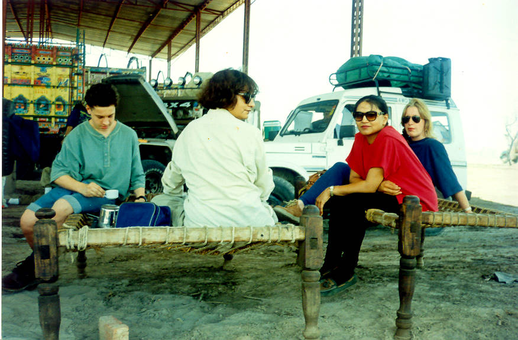

Stopped at a truck stop en route. Dr. Mansoors CJ5 had blown the seal on the power steering pump, and we spent an hour cutting up ladies leather hand bags making a new seal. The weather was well over 40 degrees.

## Comments (2)

**RAshid Younus** - March 16, 2005  7:15 PM

These are some very nice pictures. I have a question regarding Suzuki Jeep. I am very interested in visiting Chitral and Gilgit this coming summer. What I would like to know is the performance of Suzuki Jeep. I have had opportunitites in the past to go four wheeling in Oklahoma on my Wrangler. But in Pakistan I believe my only reasonable option is Suziki. And I wanted to know how did it perform in those rugged mountains. And if you have any suggestions please forward them to me. I also would like to ask you if there is any planned trip to Chitral this coming july? I will be in Pakistan and will love to join your adventure club.
Thanx Rashid

**Salman Ali** - March 19, 2005 12:52 PM

Dear Rashid,

The Suzuki is a worthwhile option if there are only two people travelling in it. It has hardly any room in it in the back. If you want a comfortable an reliable vehicle without being rendered peniless, I would suggest a well made CJ7 or a Toyota LandCruiser Prado.

Regards,

Salman Ali

