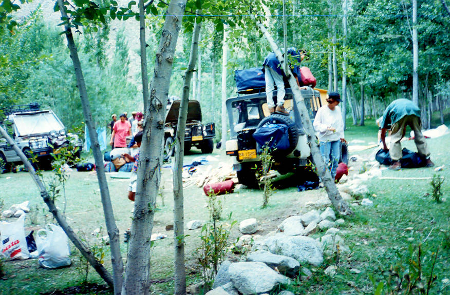

Our campsite next to a river just before Garam Chasma 3 hours north of Chitral.

## Comments (3)

**yellow rose** - September  8, 2003 10:28 PM

There's a lion in the camp!

---

**Shabbir Imam** - October 10, 2003  7:49 PM

It seems that this picture is taken by Tarzan, who suppose to hide in bushes.

---

**tanya mirza** - November  2, 2003  8:50 PM

this was one heck of a camping "night" (haha thats all we could manage... ) shazia aunty's parathas were amazing and our endless "game" to look for firewood lasted well into the evening.... a not so dangerous "lion" (imagine.. in the middle of the jungle..) "ATTACKED OUR CAMPSITE" HAHAHAHAHAHAHA Le Brilliant! ;)

---

