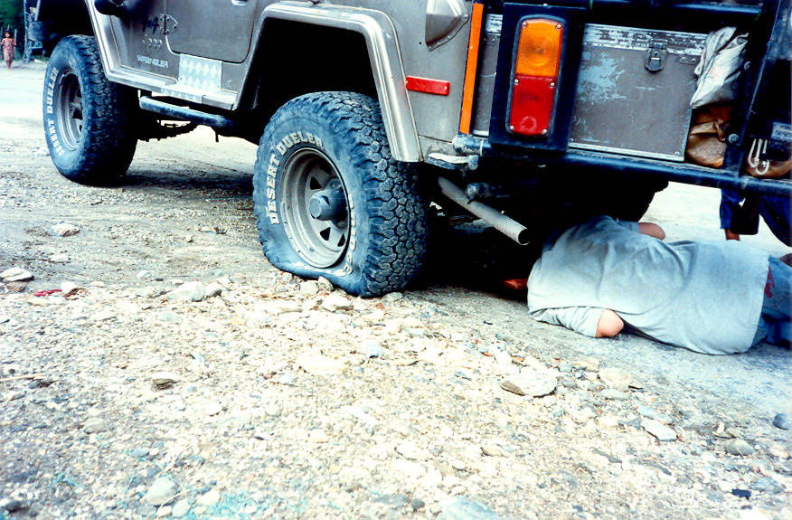

Salman is trying to fix the jack under the CJ5. Every day it would have at least one puncture, so by this time he had become an expert in the art of changing tires. The silencer above his head had also earlier fallen off.

## Comments (2)

**shehryar** - August 14, 2005  8:59 PM

Off-Road Pk

Good job!

I wanted to share a couple of off roading tips with you and all those who are interested. They are

1. A good tool to take along on an off road expedition is an air jack. This device is an automatically inflatable balloon that works to raise the jeep high enough so that the tire can be changed/other repairs made. The inflation mechanism works the same way as in a life jacket.

2. Another handy tool is a foot operated air pump. Check out the chinese varieties they are quite cheap and equally effective.

Happy off-roading.

Shehryar

---

**Wrangler** - April 27, 2010 12:48 PM

What is this desert tire doing on the rocks anyways ;-)

---

