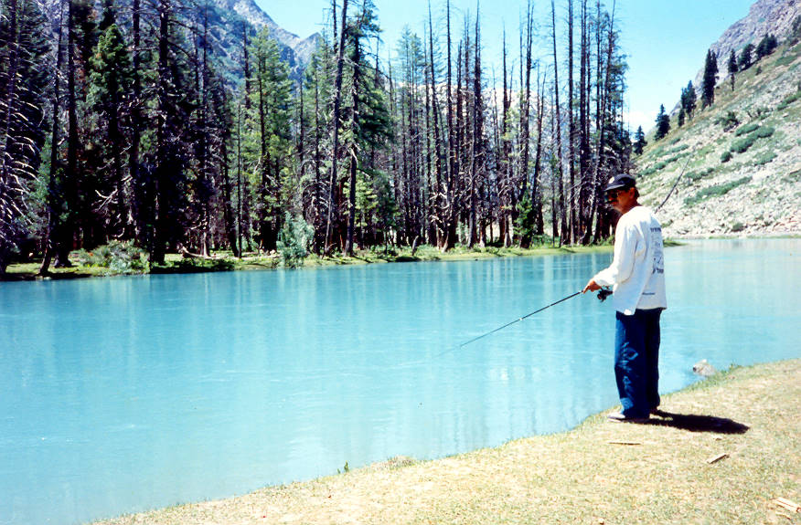

This is a river fed by glaciers just around the bend. It's one of those spots which you see in pictures of travel magazines.

## Comments (10)

**Kashif R. Siddiqui** - September 28, 2003  5:26 PM

Is that really Pakistan.....I couldnt believe it

---

**Hasan** - September 10, 2004  9:56 PM

Slam,
Realy a great website that promote people to visit and explore the hidden sides of Pakistan. Specially of such ppl who realy had great passion to tourism. I would like tu join u nice ppl in future (inshallah), I am real a "Ghoomna Kaa khwaar man " as some of my friends say.
I live in Islamabad, that's already a heaven for tourist. Plz if u visit arount it, It would be a pleasure for me join u people.

Hope to c u people here

Hasan

---

**nishant** - May  1, 2005  7:05 PM

Wow, i am from India. I have never seen sucj pictures from Pakistan. Brilliant. I would love to travel to Pakistan someday. I wish someone could tel me how to get visa and clearance to travel in Pakistan. I dream of going backpacking and trekking across Pakistan. can i get more information on this particular river in teh photograph?
Keep up the good work.
Peace for all.
Nishant.

---

**hameed** - June 10, 2005  1:25 PM

isn't maho dand lake in swat valley, around kalam?

---

**Bhaskar** - March 25, 2006 10:17 AM

Hi,

This is Bhaskar from India. Thanks for the lovely pics and narration. I would love to visit your country and meet its people, who I know, are as lovely as its sights. God bless all of you.

---

**NADEEM IQBAL** - August 19, 2006  7:02 PM

as i am a citizen of this country , but i have never seen these beautiful places before, i wonder to see this all, realy its my country..?, i am just missing

---

**shams** - July  3, 2008  1:50 PM

i like chitrali b/c thes is my village i love chitral

---

**aamir** - April  5, 2009  1:15 PM

This pic reminds me of my visit to the lake in 1990.This place is 3 hrs drive from kalam, leaving Oshu, Matiltan behind. Great place.

---

**salahuddin** - June 26, 2009 10:14 AM

Hi
this is salahuddin from chitral mastuj this time im living in malaysia kuala lumpur dear i have very nice lawari snow pic if u have need send me ur mail adrs i will send u in ur mail adrs.
thanks
salahuddin
malaysia

---

**waheed Abbasi** - September 19, 2011  1:16 AM

Golden memmores ,, pics dakh kay maza a gaya;;;

---

