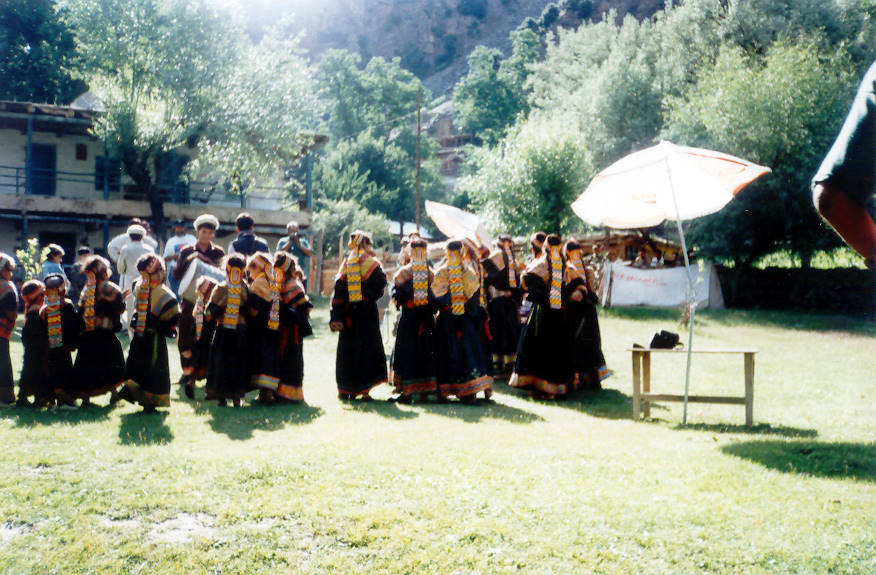

Kalash Dancers. Kalash are a miniority native non-muslim Tribe in Northern Pakistan, they have an ancient History, culture and language and are one of the five most endangered Indiginous people of the world.

## Comments (31)

**Farhan Wilayat** - January 21, 2005  9:03 PM

Dear Webmaster,

I hope you both are absolutely fine.

I was watching your page about Kalash valley and I am very happy to see that you visited that valley and subscribed the details about that valley and their people on internet.

I am also from Pakistan and I am very happy to see that page. You people have displayed very beautiful pictures on the page. It is a wonderful work.

With best wishes,

Sincerely yours,

Farhan.

---

**Khan G..** - March 22, 2005  6:42 PM

Dear guys salam

You had very work on northern areas and I think this site is very help full for visit any one. I am aslo pakisatni and visited that areas and most like was " NOMIL " in Gilgit district NOMIL is the start of CHALLAS PASS actually that is meeting point both of rock series you did not discused in your web about this JANNAT NAZEER Velly.
Now please if possible for you then do some in desert of OMARKOT, THAR etc. you may see there another lifestyle.

---

**raulz** - March 24, 2005  1:12 PM

hi guys,
This is among the few sites that provide what is expected .
Gr8 showing good to c the beuty of pak

---

**Aalijah** - April  9, 2005  3:03 PM

hello,
khush aamdeed.how are you all of u.
my name is Aalijah i live in karachi city.i like chitral valley and i love kalash valley & kalash tribe.
kalash the great valley jannat hai in world.khubsurat valley rivers peoples kalash girls.

---

**taj muhammad** - April 13, 2005 10:18 AM

hi guys

did u forget me i am taj meet u in hindukush motel.say salam to ur whole family.

---

**Yaseen** - April 24, 2005  1:42 AM

Hi Taj,

How are you? Good to hear from you. We have not forgotten you at all.

Infact, friend of mine and her husband are planning a trip to the
Northern Areas, I have suggested to them to visit Chitral. I will pass
on your email address to them so that they can coordinate their plans
with you if they finalise their trip.

I myself am quite interested in visitng Chitral and this time I plan
to make it a trekking trip. How are things with you? Are you in
Peshawar nowadays?

Regards

---

**zafar** - June 24, 2005  5:58 PM

Hiy Dears

Please be carful about the Northern Culture don,t spite in the name of Chitral the Kalash Valley there different Nationality are lying one Muslims (Shakish) & one Kalash (Non-Muslims) when you publishing some things abount Kalash women be careful there is muslims women also working together. So be careful.

Thanks

ZAFAR ALI KHAN
K.S.A

---

**Sohail Mushtaq** - July 19, 2005  2:13 PM

Dear Webmaster,

I hope you both are absolutely fine.

I was watching your page about Kalash valley and I am very happy to see that you visited that valley and subscribed the details about that valley and their people on internet.

I am also from Pakistan and I am very happy to see that page. You people have displayed very beautiful pictures on the page. It is a wonderful work.
My True wishes for you and your Peoples, i will try to see your velly very soon.
Can you send me the Detail of Trich Mir.

With best wishes,

Sincerely yours,

Sohail Mushtaq

---

**Aamir Asghar** - September 23, 2005 12:24 PM

Salam to All,
It's me Aamir I m a student of Geology here in the university of Azad Jammu & Kashmir.It's my first time while visiting the beautiful different areas in Pakistan.As a Geologist I have seen almost all NWFP and Northren Areas of Pakistan,as a matter of fact I have a lot of pictures in my photo Albums which are the marvalous and waiting to come online for u people specially the visitors.U know what i want to say"I can send some pictures to U relating to diferrent areas"if U show them here.Here I want to mentioned that If any Geologist,foreigner,visitor or a climber want to make a contact I always be thankful in real its my desire to make friends,who are the rock's lovers.Anyhow these are my contacts(jojaaamir@yahoo.com)(aamir_asghar@hotmail.com)(00923015117684).At last I want to say that its a great work by u guys to explore the hidden universe.I hope webmaster will mail mebackfor the purpose ok i will wait sir.
Allah Hafiz

---

**mina** - October 16, 2005  6:14 PM

Hi !
this is Meena from Sweden ,I really like your website it's very usefull ...actually I'm doing a project on kailash so thx alllot ... I need more information about their weddings and stuff... need help :(

---

**caesar** - December 22, 2005  9:28 PM

ishpata...
i'm a kalasha student and if you want any information..i can help you

---

**REHMAN** - February 20, 2006  5:24 PM

DEAR WEBMASTER

i hope u r fine.
i was watching u r page it is very good. but i wana just mention that i had not seen any picture of upper chitral.i think u will include them as well.And if u also include the news of chitral that would be very helpful for us.(who live abroad)

wish all the best,
SINCERELY,
A-REHMAN

---

**Ashiq Ali Amir Sirang** - February 28, 2006 12:38 AM

Dear webmaster,
Hope ur fine me too. First of all i would like to thanks you to displayed this beautiful picture to ur website. Actually iam also from chitral and belong to Ismaili muslim community and in these days iam in karachi and studying BPA(Hons) from Karachi University. I have also visited these kalash area four times, its a beautiful and oldest place of chitral. If u need any information more about kalash's lives, culture and tradition iam raedy to help you. But i have also one request for you, there are also a beautiful and greeny areas in upper chitral if u also mention about that beautiful area and display a beautiful pictures of upper chitral, like Booni, Mastuj,Parkusap,Chapari and Brep. Due to this people will also aware about that area and enjoy the beautiful picture very much..Thanks

---

**Marvin** - July 29, 2006  1:23 PM

I live in the United States and collect folk costumes. I have a womens Kalash head piece but I would like to buy the dress and rest of the traditional costume. How can I buy one? Thank you, Marvin drenoveni@yahoo.com

---

**alybhai** - August  2, 2006 11:11 AM

You have been or you plan to visit the Kalash Valleys. But keep this in mind, you won't find a pristine culture preserved from the rest of the world, a sort of Shangri-La but a 'Touristan" massivelly invaded not only by tourists, who are often irresponsible, but by their/our ideas. What is left of the Kalash culture are the ladies colorful dresses. I could say more but...it wouldn't really be appropriate.

---

**illyrian** - September  8, 2007  7:14 AM

Is there any kalash man/woman?i really would like to talk about kalash people.
Please get in touch,thank you

---

**illyrian** - September  8, 2007  7:16 AM

by the way my email address is gubetini@hotmail.co.uk

---

**Subhan kalash** - March 13, 2008  2:21 PM

hi,i m subhan from kalash.if any one wanted any kind of information regarding kalash tribe so dont hesitate to ask.
with best regards...
subhan...

---

**SHABIR SHARIF** - May 14, 2008  1:42 PM

ASSLAM-O-ALLAKUM
DEAR WEBMASTERS
I M VERY GLADE TO SEE YOUR WORK ABOUT KALSH.
I ALREADY WISIT ON FOOT (HIKED) FROM BALAKOT TO MAKRAA PEAK,AND NARAN TO BABUSAR+CHALLAS. NOW IWANT TO HIKE CHATRRAL,KALASH ETC. ARE YOU ARRANGE AO HELP IN THISN WISIT......?
ALLAH HAFIZ

SHABIR SHARIF

---

**imtiaz and eid ali** - May 18, 2008 11:18 PM

hi salam to all...although we are living in Gilgit, but unfortunately we never visied this area.

---

**Ijaz Ahmad** - June 12, 2008  4:01 PM

This is wounderful to see so many people through their own comments. I'm a sports journalist working with Associated Press and I have so much interaction with the people around the world besides in touch with the people of chitral by covering all sports events including Polo and one of my polo story, Polo at roof top, also got prize as well. So if any one regarding such affairs can contact me on my e-mail: shanankhan@yahoo.com, shanankhan@hotmail.com

---

**Eid Ali** - July 13, 2008  6:48 PM

salam to all natives of Citral & unfortunately I miss the Shundor Mela this year congratulation to Chitral for winning the match

---

**wisal daud** - July 28, 2008 11:19 PM

i love the culture of kalashi people they so beautifull they r honest in short they r so nice to passengers

---

**wasiuddin** - December  2, 2008  7:35 PM

every thing is good.

---

**s nazar Fatimi** - September 19, 2009  1:45 PM

S Nazar Fatimi Chitral
Immenece POTENTIALS of Chitral and NA
I found it among the most constructive web pages. Go on with ur creative and positive developments, and share it with others.
We have immence resources, Beauty areas, unique culture, thrilling exploring cites, mineral resources, tourism industry potentials,
unexplored trotting points, wild life rare species, water hydal and immence potentials of flora and fauna. Govertment is unaware and un interested exploring these resources. NGO's are also making ahead unfolding these sources and resources.

It is said about the NGO's (not all) that, their deeds are NOBLE, their DESIGNS are EVILS and their PLANNERS r devils. Why not they FOCUS and explore the sustainable rources of developments to change the lot of the poor peoples of the area.Pl share ideas.

ssfatimi@gmail.com

---

**Saifullah Noon** - September 30, 2009 10:02 PM

Its amazing!

---

**Sayed Shamsu Nazar Fatimi** - February  5, 2010 10:58 PM

Hi my jubilant fellows !

It is i, feel very nice to share views, news, and comments with u people. All comments are POSITIVE, OBJECTIVE, CONSTRUCTIVE and CREATIVE. What is the way to ADD album and share u, pl tell me. There is real blessings in traveling as per scriptures nd holy Quran. In Holy Quran unravellings has been announced as source of knowledge and wisdom.
for contact: ssfatimi@gmail.com

S Nazar Fatimi
Chitral

---

**S Nazar Fatimi** - February  5, 2010 11:00 PM

Hi my jubilant fellows !

It is i, feel very nice to share views, news, and comments with u people. All comments are POSITIVE, OBJECTIVE, CONSTRUCTIVE and CREATIVE. What is the way to ADD album and share u, pl tell me. There is real blessings in traveling as per scriptures nd holy Quran. In Holy Quran unravellings has been announced as source of knowledge and wisdom.
for contact: ssfatimi@gmail.com

S Nazar Fatimi
Chitral

---

**ladia** - March 11, 2010 12:49 AM

i would like to help what can i do?

---

**Fardad Ali Shah** - April 27, 2010  5:25 PM

I m student of sociology in Karachi University. this website is very good and it promotes chitrals culture. I really appreciate the work of hard working people who from the core of their heart are willing to upgrade CHITRALI'S culture.
any help from my side will be appreciated.
thanx a lot
with regards
Fardad Chitrali.

---

**Zarrie** - November 11, 2010  2:25 PM

Hi Webmaster,
I am working on a newsletter and the theme is kalash tribe for that purpose i need information.there is alot of information no doubt on the net about their history and traditions but i need more inside information like their weddings etc..if there is anyone i can contact for this purpose please let me know.I will be needing pictures also.

---

