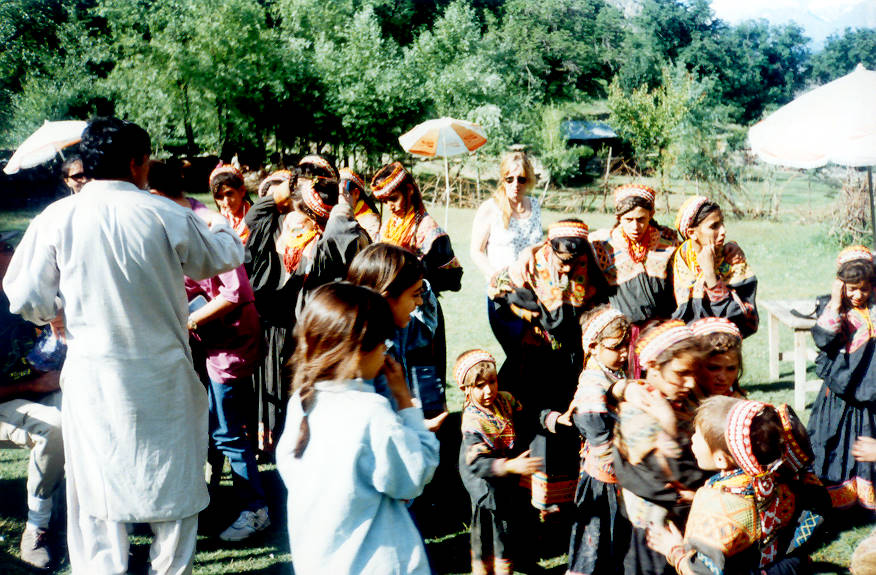

Another picture of the Kalash Dancers

## Comments (1)

**S Nazar Fatimi** - September 19, 2009  1:42 PM

S Nazar Fatimi Chitral
Immenece POTENTIALS of Chitran and NA
I found it among the most constructive web pages. Go on with ur creative and positive developments, and share it with others.
We have immence resources, Beauty areas, unique culture, thrilling exploring cites, mineral resources, tourism industry potentials,
unexplored trotting points, wild life rare species, water hydal and immence potentials of flora and fauna. Govertment is unaware and un interested exploring these resources. NGO's are also making ahead unfolding these sources and resources.

It is said about the NGO's (not all) that, their deeds are NOBLE, their DESIGNS are EVILS and their PLANNERS r devils. Why not they FOCUS and explore the sustainable rources of developments to change the lot of the poor peoples of the area.Pl share ideas.

ssfatimi@gmail.com

---

