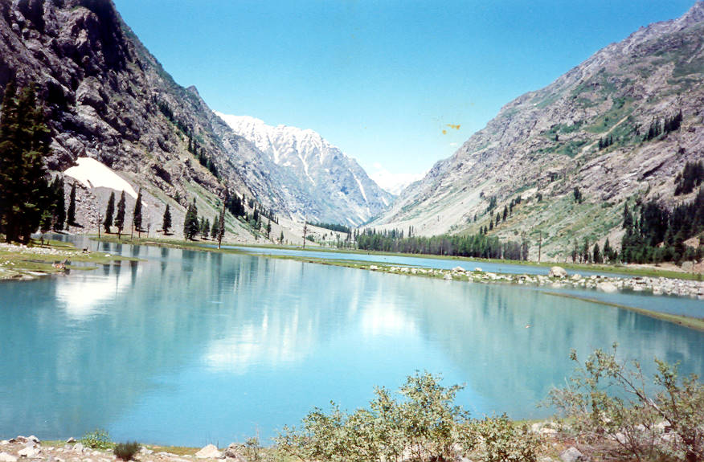

Another view of the river. This picture doesn't do it justice. The lake is at the end of the swat valley, about three hours beyond Kalam.

## Comments (58)

**Abid Omar** - July 30, 2004  6:51 PM

The lake is actually at the end of the swat valley, about three hours beyond Kalam.

**Feroz** - September 24, 2004  8:11 AM

What a beautiful photo. I would love to go there.

**Fazal Majoka** - September 26, 2004  8:10 PM

This is a great photo and thanks to put on google. I am pakistani i'll go there for sure if u wana go there and c more beautiful places contact me cause when im going back to pak i'll make a house in northen pakistan and live there okay bye and take care i have to check more pictures

**Afraz** - November  1, 2004  1:00 AM

SUbhan Allah What a WICKED !!! pic its awsome Think there r any fish livin in dat water OOOOOOOOOOHHH its like paradise.

**humayun jana nooristani** - November  7, 2004 12:07 AM

Subhan teri qudrat, one of the beautifull veiw of sawat velley. the paredise of Pakistan. I hope soon in future i am gonna visit this place.

**zafar ayaz** - December 30, 2004  1:11 PM

bosun hoi ma chitral poshaw ta giko bas.i like chitral verry much.

**shabir aslam** - January 28, 2005  9:57 PM

what a beautiful pakistan i proid on pakistan

**nabila** - March 12, 2005 11:40 PM

taarif us KHUDA ki jis nay jahan banaya.........i just love this place........a peaceful one.

**waseem** - March 21, 2005  1:25 AM

sir i would like to clarify the name if this lake is MAHU DHAND...its 3 kms north or kalam!! and indeed it is very beautiful as ive gone there more than 20 times......if u want to see a place more beautiful than this one go to KUMRAAT valley in the dir district...it is 10 times more beautiful and the beauty of it is that it is still a virgin valley.....u can say i grew up in the whole of the northern areas as my father was the head so i know these places like the back of my hand and if u need more info abt other beautiful places i wd gladly help

**Malik** - March 25, 2005  5:50 AM

The picture shows of a side of pakistan which represents infinite beauty if it can be put that way??

**rashid** - April 26, 2005  9:56 AM

when i went there i was so impressed and i felt that i was paradise.it was mamoribal journey and i can not forget it.

**Nadeem Arshad** - June 11, 2005  4:01 PM

Its realy a beauty full place. our trip is going in sawat and we should go there. There is no compatibility against the nature.

**naveed mardani** - June 12, 2005  1:08 PM

da deer khakwole jheel dai .it is very baeutiful lake here the nature is in full view.ok if u got an opertunity then go ther

**uzma fouzia** - June 25, 2005  9:15 AM

what a beautiful place on the earth.i like this pic.yeh musam yeh mast nazarey piyar kero tou in say kero. i love naran.kagan.kalam.sawat.chitralplaces.murree so soAllah Tala mery mulik ko buree nazer say bachaey ,Aameen,

**Dr Zaheer Sattar** - June 27, 2005  1:44 PM

I visited this lake in 1990, i was 17 then. its route was wild and genuine jungle ride then...........the lake itself is actually a zigzagging network of blue streams.........we were the only visitors there that day.............upper swat at its best..........Mahodand's draems have never left my sleep eversince..... i was a beginner photographer then.....i couldn't capture it the rightway........now i am a semi pro.....i will do much better now.

The photographer of the above image says it rrrrrrrrright........it doesn't do justice to the actual lake.

Now a days i hear its been polluted by khokha hotels and rubbish stuff.....a lot of jeeps go there daily..........and pollute it even more...........the typical pakistani side effect of development.....

If any one wants the scene as it is in the photo (actually it is much more), the best time to go there is before july 15.....after that the ground levelling blue zigzags are no more.........water starts receding.

go there if u can........and tell whats left........

**khairullah khan** - August 12, 2005  6:28 PM

i proud that i born in pakistan and in a patthan famely pkistan is a paradise in the earth pakistan is the swetzerland of asia pakistan is the country of the brave man

**shamyl ali** - August 15, 2005  7:13 PM

i visited this lake in 2005, in july.This lake is at the end of SWAT valley, and then u can goto chitral which will take you 2 days by walk as there r no roads OR tracks. This lake is a start of swat river, and is very beautiful place.The only thing i didnt liked abt it is, the polution there! which is caused by the tourist etc.My request to u all " visit this place but please dont ruin it".
A perfect place to visit! luv pakistan~!

**ahsan** - August 23, 2005  9:51 PM

the kagan valley is the most beautiful valley i have seen in my life and "two lakes mahodhand and kandol"

**zeeshan** - September 16, 2005 10:17 PM

i visited this valley.2 days before..its too beautiful(SUBHAN-ALLAH).

**M,Afzal** - October  4, 2005 10:29 PM

i prode to be Pakistan.i love this pic.InshAllah i visted this place after Ramzan_ul_Mubarark.i agree with uzma fouzia& khairullah comunties . naran.kagan valley is a realy switzerland . ai Mulik tu sada abad aur shad rehy,Aameen,

**Fahad Ghouri** - October  7, 2005  2:38 AM

It is.........beautiful!

**Malik Khurram** - October 20, 2005  1:20 PM

i think kalam is the paradise of the world. it is very beautiful

**zeeshan** - November 27, 2005  9:19 PM

hi my name is zeeshan i live in dublin ireland and i also veiw switzerland and ireland is also beutiful in pakistan i live in abbottabad and sure u maran kghan is more beutiful then switzerland and ireland.

**Dorrabb** - December  2, 2005 12:47 PM

I've been to Kalam once. But I really did'nt know about this lake, the view of heaven. If some body would have told me, I would definitely visit this place. I would love to visit it Kalam again just to visit this Lake during my next trip to Pakistan.

**Malik waqar ahmad** - January 21, 2006  4:09 PM

Ho I liked this lake so much ,because it's very close to nature and I like the nature there are so many other lake in nothern area but I fond it's very beutifull,when I visited at this place over there I felt that I m sitting around the a heaven. all round areas of this lake is loook like a shangrilla.

**Abdus Salam** - April  8, 2006  5:50 PM

Aaaaaaaaaaaaaah.............what a flash back of memory..
I have been to this lake 10 years back...
This pic is extremely injustice to tthe lake:) this lake is far beutiful than this pic .I would say this pic is covering 10% beuty of this lake

**Salmaan** - May 23, 2006  1:47 AM

Thanks to your mother who invited me to visit your website. The picture is fantastic, superb. And pl thank her for telling us about Chitral. will make the trip infortunately by air.
Regards, your niegbour Salmaan

**F Shoaib anjum** - May 23, 2006 10:51 AM

thanx to google.ur show this pic.i proud that i m pakisatni.i love this pic .naran kaghan is the most beautiful places.Sadaa Geo.pakisatn.i love u fs

**M. Zahir Shah** - May 26, 2006  7:51 PM

Even if visited more than one time its charm will be higher than your previous experience.

**yasoob** - June  2, 2006 11:58 AM

I HAVE BEEN THERE, I HAVE NEVER SEEN SUCH A BEAUTY OF NATURE, NOT ONLY THE LAKE AND ITS SURROUDING ARE BEAUTIFUL BUT ALSO THE THE WHOLE JOURNEY FROM KALAM TO LAKE IS ABSOLUTELY TREAT TO WATCH, I HOPE EVERY BODY WILL ENJOY A GREAT DEAL.

**Ghulam Farid** - June 14, 2006  1:48 PM

Hi i visited this lake in 2003 but according to my views the nelum valley is most beautiful valley of Pakistan and in Nelum especially Tao but,Arung keil are just like paradise.

**Aisha Khan** - July 11, 2006  2:02 PM

Just came back from Mahudand lake, it is a beautiful place capable of having rock climbing resort in Pakistan. The terrain is full of amazing rocks, gushing cold waters and lots of adventure. Really like this place and never forget the log bridge underwhich cold water is rushing down. Nature is amazing.

**hasan** - July 14, 2006  3:09 AM

I am very concerned about rampant deforestation I observed in the area

**Ratan Lal** - August 16, 2006 12:00 PM

I think kalam is the paradise of the world. it is very beautiful

**khalid zaheer** - October 22, 2006  1:19 PM

Viewers, this picture is not presenting even a 10% of actual beauty of this place. Subhan Allah what a beauty full place is this. I am, certainly, not able to explain its charm and beauty in words. Allah is indeed certainly greatest of all.

**Fahad Iqbal** - April 25, 2007  6:00 PM

just a word want to say about the picture. ...... its amazing. i must go there and seen it from my eyes the beauty the God made for his people in pakistan.

**sadaf khalid** - June  3, 2007  4:20 AM

iwill goin1997.it is more beautyful place.the riveris very dengerous.the water is very cold.his style is very charming.but i love very ever

**saqib iqbal** - August 19, 2007 11:58 PM

this is a very wonder full place .ur mind will not want to leave this place and u will come again and again to see this beauti of nature.

**shams ur Rehman** - September  4, 2007  8:23 PM

God has gifted pakistan beautiful places in the form of fertile grounds,wondurful lakes & rivers AND marvellous mountains. It is our responsibility to take care of God's gifts.It is necessory to keep these places clean so that nature can be seen in it's original form.At the end we should keep our hearts clean and beloving for other pakistanees like these places.

**Muhammad Ashraf bugti** - September  6, 2007 12:07 PM

Pakistan is a very nice Country
I like a Pakistan

**Muhammad Nauman** - September 22, 2007 11:44 AM

Woh lmahay wo yadein koi na janay ,,,,,,, bus ik lamhay k liye insaan mazi mein chala jata hay aur bas

**Nomi Gojra** - September 22, 2007 11:51 AM

Pakistan is not only country its a place to visit and enjoy each and every wheather of the world like winter, summer, spring etc. I am proud to ba pakistani.
Ithink we have no need go out side of the country to spend our holidays we must visit the NWFP of Pakistan.

**shaz** - October  5, 2007 10:32 PM

what a place
hum idhar gay hain magar aik lamhay kay liay main nay ye zarour socha kay ye duniya main nai ho sakti what a beauti kya baaaaat hai app zarour jain idhar

**FAROOQ AZAM** - October 13, 2007  1:09 PM

I visited this place on July-19-2007 and its really a good place i wish to go there again when there will be peace. Due to STUPID MUSHARRAF policies this area become hell for visitors otherwise this place is a heaven. There is another lake SAIFULLAH just 2 or 3 KM from Mahodhand also visit that place its more beautiful then Mahodhand

GOD BLESS PAKISTAN

**kiran** - October 17, 2007  4:23 PM

This valley actually the real picture of life. When i went there that time i felt it is the God,s Creation for Human beings to watch and enjoy the Beauty of Nature. Allah made for all Bautiful things but man always said no its not enough so no doubt its a very baeutiful place and realised how much Beautiful he is who create All beauty of nature for man. Thanks for Allah who gives alot of Blessing upon us by throwing the light of happiness.

**sajjad** - November 29, 2007  2:42 PM

this is very beautiful and u will feel like freezer in june and july specially in morning time upto 11:00 AM

**Nawab Sadbarg** - March 24, 2008  4:02 PM

since the title is chitral, u should have posted all pictures from chitral under this title. this lake is not situated in chitral. however, i appreciate ur effort and i like the picture

**syed imran shah** - April 15, 2008  2:50 AM

i love chitral chitral is a paradise of the world.it is full of natural beauty.chitral have got the most civilized people.hhhhhooooommmaaaaahhhhhhhh mising u

**jamil a dost** - April 15, 2008  3:03 AM

i love my sweet chitral the most beautiful place which is located in between the mountain having grate people oooohhhhhh ma zannnn chitral

**Waseem Ahmed Kausar** - April 16, 2008  4:28 PM

Its very beautiful lake and I visited three times. Twice on a 4X4 jeep and once on my own motorbike. It taken 2 hrs. and 30 minutes to reach on motor bike. it was amazing trip. We have a little group to bike riders and we often go to such places like Kaghan Naran, Swat, Chitral and Gilgit also. So i can say that the roads of northern areas are on my finger tips. Any one can take guidance while going to arrange a trip. My cell no. is 0300-9561511

**salam_khan** - May 14, 2008  2:48 AM

I Had been there Itz very cold place take a blanket with you if you wanna go there are some boats in the Lake Which Takes you to The Water fall About 25min on boat from lake itz really enjoyable ( wanna Know more just ask me none31952@yahoo.com ) But you can only go there by Jeep or some sort of offroad vehicle.

**burhan ud ding** - June 24, 2008  4:33 PM

i really love it

**Nadeem** - June 29, 2008 12:32 PM

I wonder why is it called a LAKE, where as it is a RIVER

I went there twice in 2005. I was depressed to see Swat, which unlike it's reputation is not beautiful or green (even Islamababd's Margallah mountains are more green), the area ahead of Swat is somewhat better but nothing worth mentioning, five hours of drive ahead of Swat takes u to Kalam. Kalam and areas are are beautiful, serene and green. I was impressed by the two hour drive and the land/area falling on the way and Maudand River's beauty. It is not a lake, but a river jutting out of the glacier ahead of Maudand and then going all acorss Swat to reach Nowshera etc

**asfandyar** - July 26, 2008  9:09 PM

Well, to be realy honest, i must say this picture fails to explain the real beauty of Mahodand. The place is for most beautifull then it looks. Those who have been there will agree with me. But But But....... There is no question regarding the beauty of that place. Its beautiful. Its paradise on earth.

**ajab khan** - August  6, 2008  1:33 PM

It is such a wonderfull place.i would like to go there.i also stay in swat valley but i have never visited this place.

**Imran** - October 14, 2008 12:54 PM

Very nice picture I like it pls do yr work more.

**alam** - August 18, 2009  2:29 PM

paradise velley in pakistan. I saw the lake date 08 July 2007. very very beautiful place Hil, and nature sceene in kalam velley.

**Inam** - July 30, 2011 11:10 AM

The beautiful scenery i have ever seen in my life. I love you swat and I love the beautiful sights of FALAK SER.

