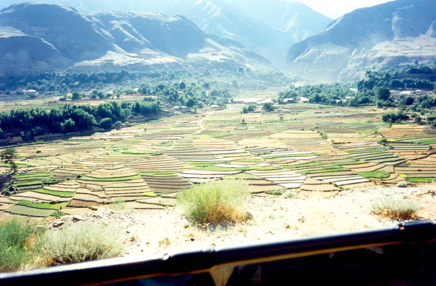

A beautiful view before reaching Chitral.

## Comments (4)

**Abdur Rahim** - April  5, 2004  5:35 PM

Great pictures can i send you a picture of my village Booni (Chitral)

**Nour ull Huda Yaftali** - August 23, 2007 12:19 PM

Pls send me the photo of Laspur and shandur polo festivel.

**Wrangler** - April 27, 2010 12:51 PM

@Abdur Rahim, I've been to Bunni (the first establishment after Shandur towards Gilgit) and I love that place. I camped at the rest house old building in 1992 during our bike (one yamaha 100 and two people) expedition in the north. Cant forget it.

**Wrangler** - April 28, 2010  2:05 PM

My apologies for the previous comment as I mixed up Bunni with Teru. Bunni falls on the Chitral side.

