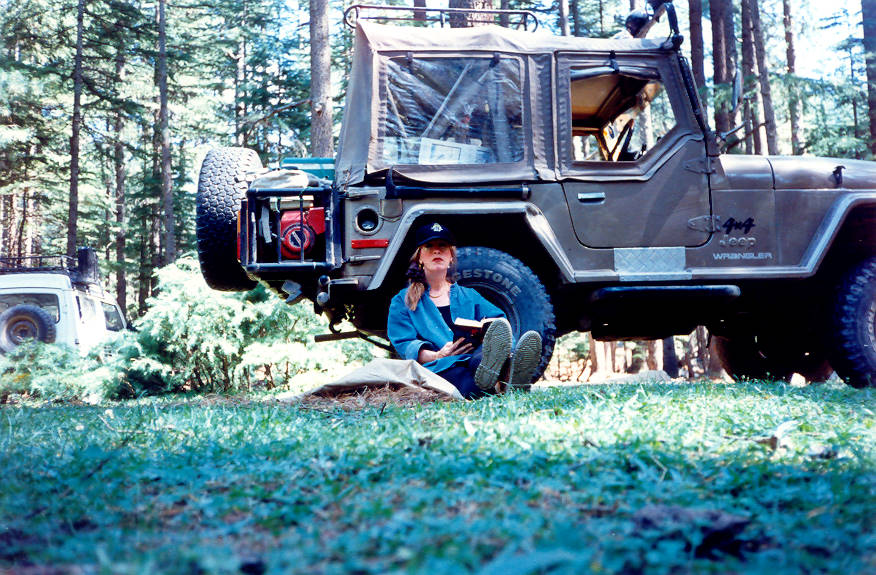

Susan reading a book by the side of the Jeep.

## Comments (4)

**fahad ali** - July 19, 2006 10:50 PM

Nice picture.Khalid I also want such a lugage carrier at Back of my jeep & what about that Roof Rack.Is the pipes going through the roof cover.If it is water will be through?I am likely to travel to deo Sai (skardu) So wana increase the loading capacity of the jeep.Needs your technical advice & help regarding Roof Rack & rear lugage carrier.It should be removeable as in season we usually use open top for hunting.Send me few close up pictures of Roof rack how it fiited with the exsisting bars of the jeep & how rear carrier fiitted.Looking fwd for your quick reply..............fahad

**Anonymous** - November 10, 2007  4:17 AM

Please use the right terms hunting is with dogs on horse backs; everything else is shooting and both are very feudal habits.

**ajab khan** - August  6, 2008  1:44 PM

nice jeep.i would really like to have that kind of jeep.

**karam ali** - November 19, 2010  8:11 PM

nice picture i love this picture

