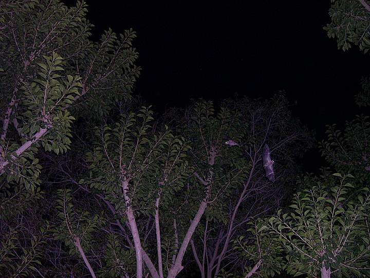

flying around the trees next to the tents

## Comments (2)

**Kashif** - November 29, 2006 12:21 PM

I was also travel to Dureji in 2005, after crossing main Dureji ( 0 point) after a journey of 25 KM there was also a beautiful place known as ARIPIR, due to problem in my vehicle i was not reaching there, locals of Dureji inform us that this is a beautiful place, have u any more information about this place??
If yes please inform me.

Thanks

---

**jawed shaikh** - March  1, 2008  1:11 PM

hi
I was also travel dureji in 2006. on of my friends town namely Behlul. It is a very good place and we also visited Dame. we lvied there 2 days and see the natural things and mountains.
Thanks

---

