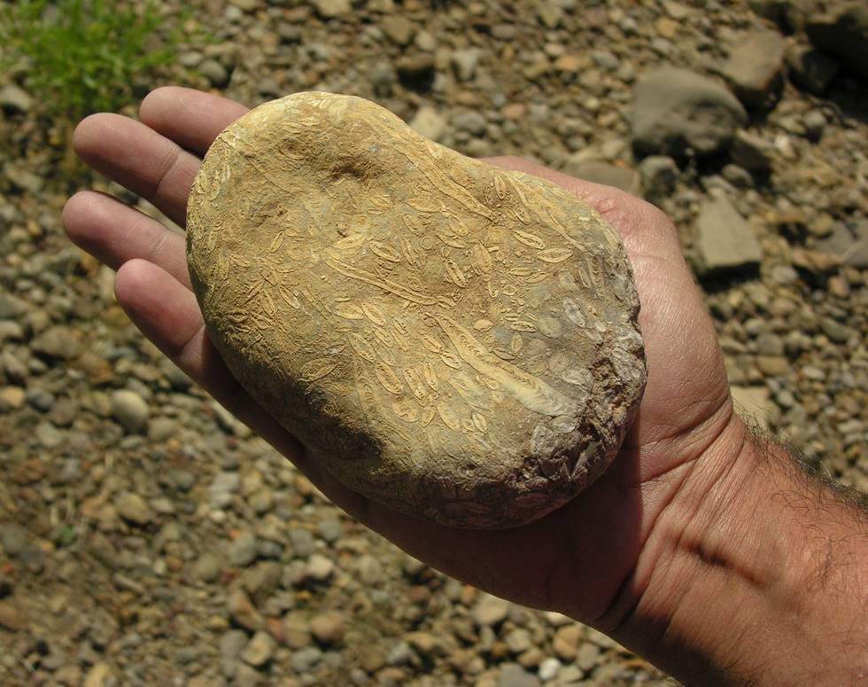

## Comments (3)

**hameed** - March 20, 2007  7:12 PM

interesting find.

would be nice to see a macro shot of it.

**Ibrahim Raja** - October  2, 2009 10:59 PM

Nice Discovery.... it's some sort of fossilized rock... better take an opinion from some expert... maybe u have discovered a new fossil ground of PK:)

**sam** - January 13, 2011  6:48 PM

looks to me like some kind of bacteria under microscope

