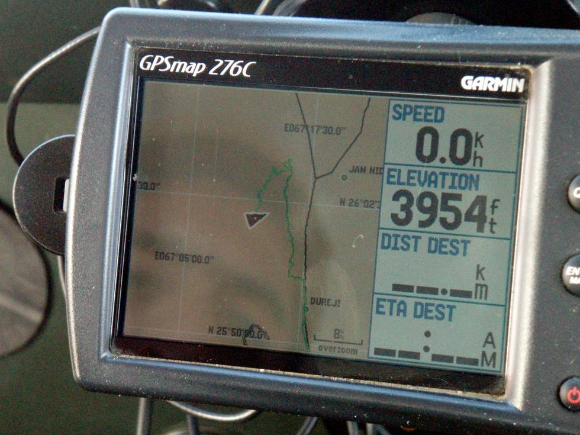

Andahar mountain is approx 4000 feet high, so it remains cool all year around.

## Comments (3)

**Shahid** - September 30, 2007 10:46 PM

The coordinates in your Garmin 276c read N 25degrees 50 min and I guess 30 sec and the Latitude is E 67 degrees 17 min and 30.0 sec (something incorrect in that reading?); Dureji per Google earth is 25 degrees 53 min and 13.61 sec N and 67 degrees 12 min and 50.36 sec E with an elav of about 1013 ft. There can�t be a difference of 9 minutes Longitude between Dureji and the top at Andahar. Either your GPS not zeroed or something amiss.

**KO** - October  1, 2007  1:28 PM

I will have to recheck the GPS, I am pretty sure that the waypoint is saved there. I don't think a GPS has to be "zeroed", they are generally accurate with 10-50 meters!

**salman atif** - May 21, 2010  9:57 PM

I normally travel with a technical GPS without maps on it and even I get 5 m deviation from normal although my device is suppose to be more accurate. As KO stated GPS hasn't gotta be pinpoint as maps are made to various projections which lead to lack of conformity. Its like trying to flatten an orange. And as google itself says its Google Earth can vary to at least 5 m or more

