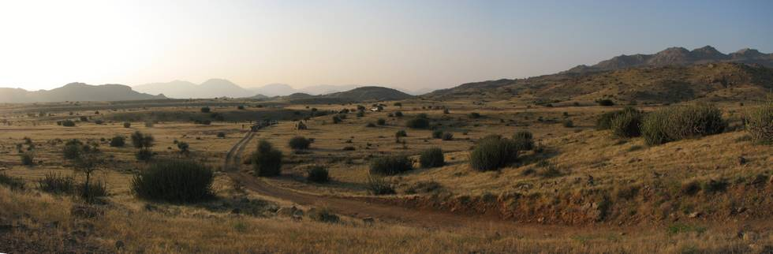

## Comments (3)

**humayun khan** - March 26, 2007  2:23 AM

great pics, u got the eye for it......
where r the other 1000 taken by thr pro ?
cant wait till next trip

green jeep

---

**Shahid** - September 30, 2007 11:16 PM

If one travels further North of Dureji some 50 mile keeping Hub to your West via Kotiro to Badal Khan Goth (260 30� 59.47� N and 670 06� 00.07� E) then another 36 miles to Lak Pass (keeping Gorakh top ridge to your East), Cross the Lakh pass (at least that's what it was known by the locals at that time and in the one inch map, if I correctly remember)) you people can drive into Sindh to Dadu . In 1975, while in the Army, we almost made it on wheels till a few miles short of the pass. After that for a couple of miles it was a beaten camel track with huge boulders. I am sure there may be a jeepable track now.
You guys are having fun, Great. All the best.

---

**sam** - January 13, 2011  7:02 PM

another great exploration... bravo !!

---

