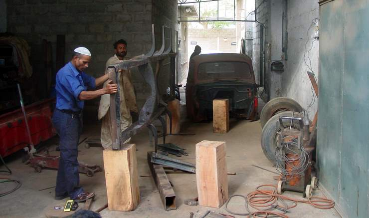

The body is removed and the chassis is being inspected.

## Comments (1)

**Darie** - April 28, 2012  6:13 PM

that is a common sytmpom for the EGR sender to be bad. I replaced it and found they were correct. That explains why it said too much EGR AND too little EGR at the same time. Is there vacuum in the line that operates the valve? You are not having the same sytmpoms, but it still could be your sensor, especially since a new EGR didn't help.Are you under the impression that running the car for some time will clear the code or did I misinterpret what you said. You cannot do that in a practical sense. Yes, if I remember correctly, it will eventually reset after a huge number of key turns, but you really need to erase the code.As I remember, I had to replace that sender twice, but I had that car a very long time. Also had to replace the VSS sensor a couple of times.Please check your brake lines in the area under the driver's side seat. They have a design defect that might still be there in the 2001. It causes the lines to rust out and you loose ALL braking with zero warning. Very scary, but they kept it secret.

