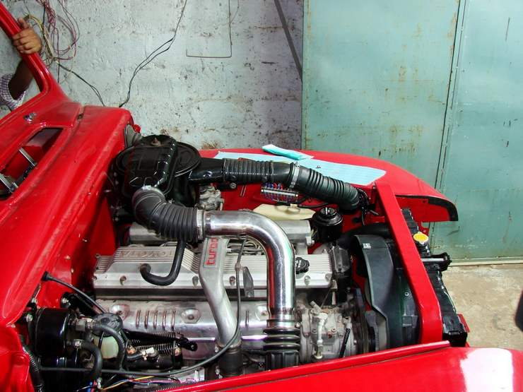

The engine bay is full up.

## Comments (5)

**Ali Raza** - September 24, 2007  7:22 AM

you need to change the order of the pictures! it needs to start with the truck in the scrap heap!

---

**KO** - September 25, 2007  9:45 AM

Order has been fixed! Was a bug in the system, all the pictures were in the reverse order.

---

**faizi** - October 10, 2007 12:32 AM

no accent, surprising??? need more red tone i guess?? isnt it

---

**Roy** - November 18, 2008  7:39 AM

I'm surprised there isn't a centrifugal air pre-cleaner on this truck. They are very common for diesel engines - especially when turbo-charged. In dusty conditions they will save your truck from choking on a clogged air-filter, and prevent having to try to clean an air filter in the middle of a dust storm. Just a thought...

---

**Hamid Omar** - November 22, 2008  7:45 PM

Well if you are talking about the Red Ford F1 truck - it rides high so some dust is avoided - inside the bonnet it has a centrifuge filter + a super large sized oil bath filter - most of the other vehicles needed their air (paper) filters cleaned every morning - the Red truck could have gone in same area for another week or more before it would have needed cleaning!!

---

