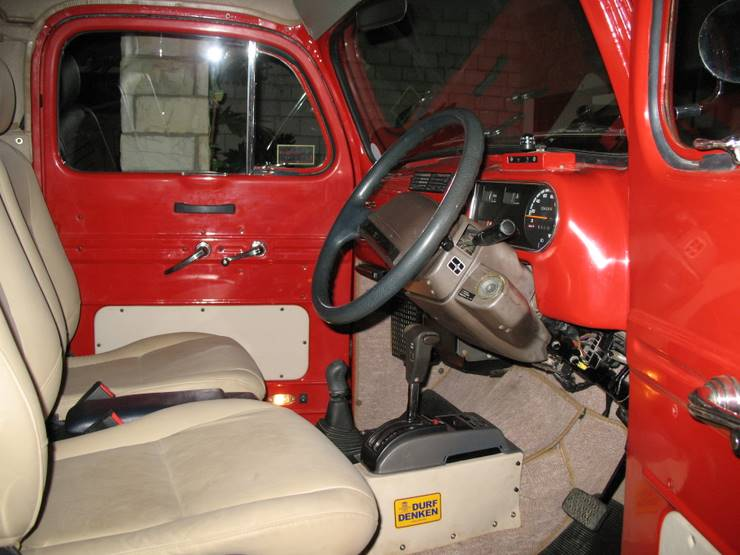

## Comments (8)

**Pete** - October  4, 2007  7:04 AM

You did an awesome job. Our website is www.fordtruckclub.com. My truck is the green 1949 pickup. I also work for a company that sells truck parts www.pros-pick.com. You could also check out that as well. - Great job - the truck looks really good.
Pete

**faizi** - October 10, 2007 12:25 AM

i can see no beer holder AO ;p

**wajhi ghumman** - October 11, 2007 12:10 AM

AOA,

Congratulations, Its a really amazing job you guys have done.

Wajhi

**Memon Akhtar** - August  4, 2008  3:19 PM

i would love to take a ride or i ll feel my self in heaven if i get it to drive
well the f1 is simply hot

**Imran** - September 30, 2008 10:42 AM

WHERE THE AIR CONDITIONER IS INSTALLED?

**Waqas** - October  6, 2008  3:41 PM

Where was this Ford refurbished???

**Nadeem** - November  5, 2008  1:14 PM

I'll love to take a ride on this newly furbished Ford truck. Its really amazing!!!!!!!!

**Ted** - December  3, 2009  5:34 AM

One of the sweetest '48 rebuilds I've ever seen, that's for sure. Bet those handles at the top edges of the bed come in handy!

