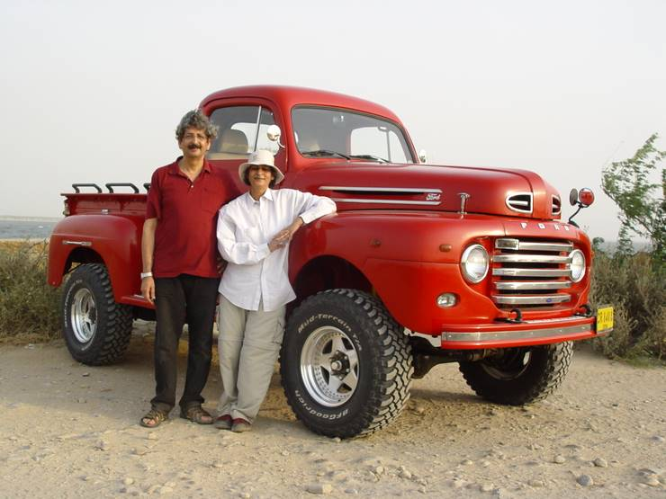

## Comments (11)

**bashir shah** - October  1, 2007 11:23 PM

Amazaing , mind blowing what a beauty ,great work and great result ,

---

**Masd** - October  7, 2007  6:32 PM

A truly loving story.

---

**mehryar** - October 21, 2007  2:45 AM

awesome car ! brings a smile to your face.

---

**hammad** - November  7, 2007  2:44 AM

You owe your wife some words of gratitude for the idea... :-)
nice work

---

**Muhammad Maaz (Mani)** - May 10, 2008  3:20 AM

Still Together Still Going Strong
I Appreciate and i Like ur Work

---

**sharjeel shaikh** - May 10, 2008  2:41 PM

HI ..ITS REALLY A DEVOTED FEELINGS TO WORK..

---

**Mike** - January 30, 2009  8:05 PM

Testing to see if I can post as I was getting a error message

---

**Murad A** - January 30, 2009  8:12 PM

This is an amazing truck and what a great job on restoring it to the bones. I was wondering if you can share as to what was the entire cost from point A junkyard in Cali to point B fully restored in Karachi. I have a 1973 Ford Muctang MACH1 that I am wanting to restore. regards

---

**Faisal Khan** - February 26, 2009  4:23 PM

Great article, read effort, great truck, and wish you all the best.

---

**Fazal Rehmani** - October 26, 2010  1:51 PM

Great story.

---

**Anjum** - March  1, 2012  1:20 PM

All the hard work paid off just fantastic

---

