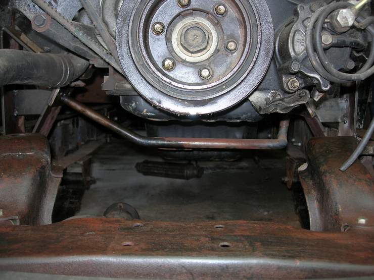

This picture shows the supporting bar connecting the two engine mounts together. Without the bar, in bumps the weight of the engine puts a lot of load on the chassis and can push them apart.

## Comments (2)

**imad** - September 24, 2007  6:52 AM

This pic has been here a while, don't know how I didn't notice it before, but that bar is not going to do any good. In order to serve its intended purpose, it needs to be dead straight. All the bends in this bar will flex if the frame rails start spreading.

**Hamid Omar** - October  2, 2007 12:11 AM

This is a torsion steel bar (not a ordinary bar), which flexes with the chassis and hopefully will do it's intended job and will never fail.

