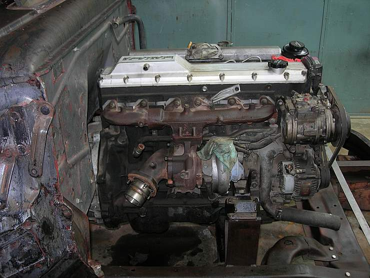

After straightening out the chassis, the next step was welding on engine mounts and putting in the engine - the mighty Toyota 4.2 Turbo diesel, which is perhaps the finest diesel engine around.

## Comments (4)

**MHAMZA** - August  2, 2007  6:56 PM

AOA,

The engine looks in pretty good shape. I am wondering how much did it cost and can this baby live happily inside a CJ7's bay?

---

**MHAMZA** - August  2, 2007  6:59 PM

AOA,

The engine looks in pretty good shape. I am wondering how much did it cost and can this baby live happily inside a CJ7's bay?

---

**Hamid Omar** - August  8, 2007  3:12 AM

HMAZA - In Pakistan (eg. Shershah,Karachi) the engine with automatic 5 speed 4X4 gearbox would cost you about Pak Rs.300,000 depending on conditon. The one put in the Ford F1 is a non EFI 4.2 litre turbo (in line 6 cylinder) from a 1992 Toyota Land Cruiser. Also the differentials are of the same SUV. Rear differential is a limited slip type and the drive is full time 4x4. Yes you can fit it in a CJ7. The Ford F1 is now expected to be on road 1st week Sept. As soon as the rainy season ends, we plan to take it on its first offroad test run to the Hingol valley. Regards, HO.

---

**izam** - April 28, 2012  7:12 PM

You can get the codes ran for the check engine light at most local parts sretos. Many of them will check the codes for free and tell you what they may be. The light could be for the same reason the 4 4 light is staying on. It's hard to say without getting the codes ran first. Have that checked and you can update your question accordingly.

---

