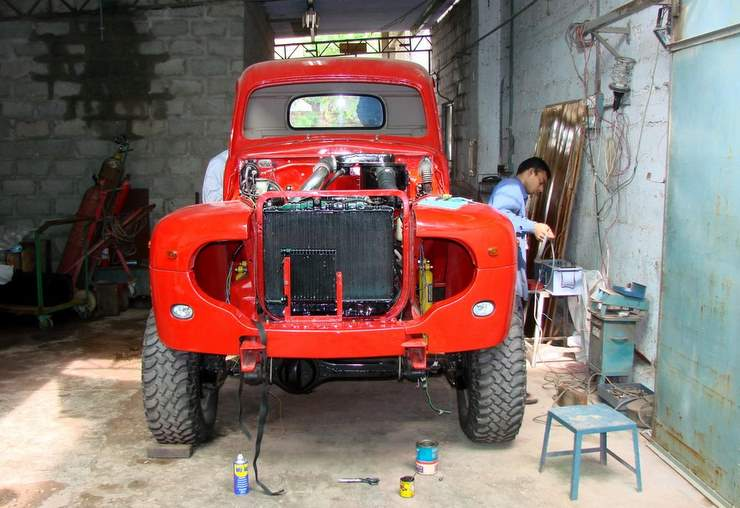

## Comments (2)

**shahid** - September 19, 2007  6:37 PM

Are these tire BFGoodrich M/T? and for howmuch did you get them for?

---

**Hamid Omar** - September 22, 2007  2:25 AM

Dear Shahid,
The tyres are BFGoodrich Mud-Terrain TA LT285/75R16. I bought them second hand (from Shershah) set of 4 complete with alloy rims for Rs.30,000. Was lucky to find the set like new - tyres were probably not used and had the little rubber moulding protrosions still intact. They are not available new in Karachi - one would need to order a set from the dealer.
The truck is finally on road - will take some pictures of it this weekend and will post it on the web soon.
HO

---

