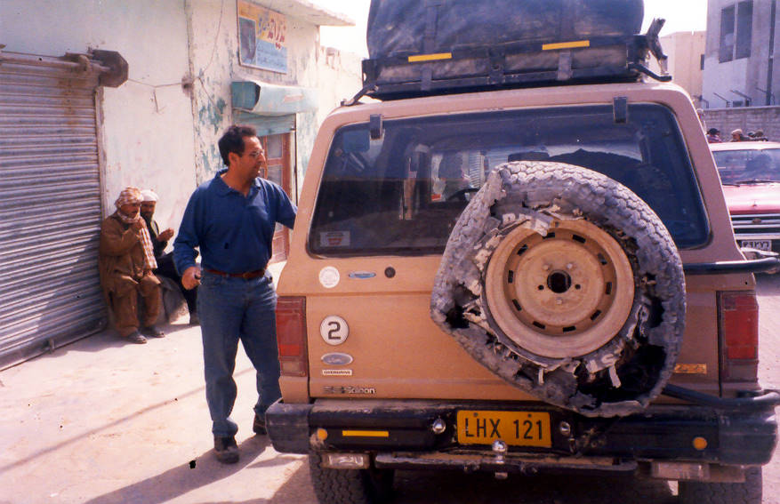

The remains of the Bronco's Desert Dueler. They just don't make them like they used to!

## Comments (6)

**simon** - January 13, 2004 12:39 AM

now that's awell shredded tire...almost brings a tear to one's eye.. your parents must be very proud!!!

---

**Abid Omar** - January 18, 2004  3:29 AM

It was my father who was driving the Bronco then! We buggered two tires and had to buy one at this town. Turbat it was, I think.

But generally, I wouldn't recommend a Desert Dueler to anyone. They wear out too fast, and don't perform well at all on highways. Now we have Dunlop Grand Treks.

---

**Richard Flewelling** - April 14, 2004 12:52 AM

Send the photo and story to Bronco Driver Magazine. Attn John Goethert
john@broncodriver.com

---

**Slim** - October  6, 2005  1:43 AM

nothin like the classic OJ Simpson style Ford Bronco

---

**Alex** - October 16, 2005  1:23 AM

Dang, that one went out in style.
Slim- that's not a OJ style bronco. It's a completely different style Bronco

---

**Lisa Liu** - April 25, 2008  3:30 PM

BUY OTR TIRE

---

