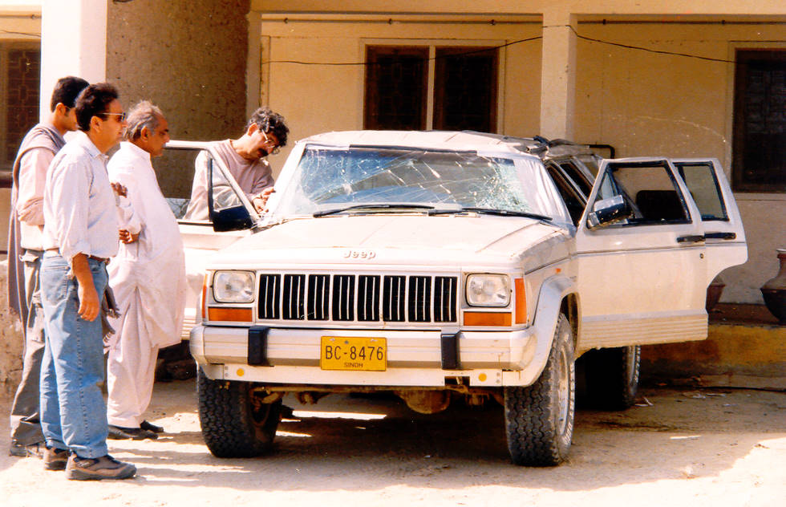

HO's Jeep Cherokee the morning after the accident.

## Comments (5)

**Dr Sal`** - July 26, 2003  8:49 AM

Like they've never seen a Cherokee before

**kabir omar** - July 29, 2003 12:14 AM

Yeah...I know how it feels I was there, sitting next to Hamid. It was a slow roll over.....was like watching a movie in slooow motion, but when it came to a complete stop, the horror of it all hit me real hard ....get me out of here...pronto!!

(Friends & relatives dont be alarmed I am alive & well)

**viewer** - September  8, 2003  2:11 PM

Khan Sahib aate ki chakki dekhi aap ne?

**Kyle** - October 17, 2003  7:59 PM

I know how ya feel buddy, i jus rolled my lifted cherokee yesterday, with 2 fine young ladies in there with me. THank the Lord the girls wernt hurt and neither was i. My jeeps totaled, i guess ill start over.

**Naeem** - April 28, 2004  9:20 AM

her hadisay (accident) say seekhta hay INSAAN tameer ka sabaq....sabaq bhool jana bhi aik hadsa hoga...

