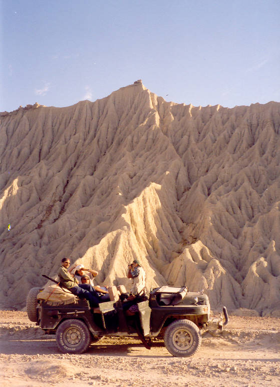

The chinese jeep with a very picturesque rock formation in the background.

## Comments (8)

**rory white** - May  1, 2005  2:26 PM

beautiful picture. i am interested in what you thought of the Chinese jeep. i'm considering purchasing one in the U.S. it's here and smogged and everything.

had a european jeep cherokee powertrain put in it, 4 cyl turbodiesel.

it's very clean. would you recommend such a vehicle for use in the U.S.

it's a 1999 BAM 2020.

thanks, rory white

**roger worldie** - August 17, 2005  8:38 AM

I am wishing to purchase a Chinese made Jeep and import it to India. Question:

What is best Gasoline or Diesel? For power and economy.

What is the vehicals value in India or Pakistan.

Thanks

**Fritz Rotheschild** - September 24, 2005 11:28 AM

Don't even think about buying one of those pieces of shit,one tried to hang with us at the Prim voyage and it was falling apart literally.A whole group of us had to piss in the radiator after we put and egg in there to stop it from leaking and the four wheel drive went out along with the brake calipers and eventually the transmission...It was a 1999 BAM 2020...What a joke that, poor guy had to leave it up there and catch a ride back down from some kid in a VW baja bug...We weren't gonna drag him along with us after he made us waste a good piss on that piece of junks radiator,I'd have rather pissed on a tumble weed atleast it would have got something out of it like the nitrogen...

**Hamid Omar** - August 11, 2007  4:52 AM

When we talk about Chinese Jeeps in Pakistan - it means the older Chinese army version - the heavy tough body is about all that is Chinese, underneath the engine and drive train is of Toyota. When rebuilt/altered properly, its a fun machine with good off road capability. The one in the picture has been built like that and is mostly used for hunting trips. Yes I agree original Chinese jeeps are no good! HO

**Cajetan** - October  8, 2007  3:34 PM

What your opinion on the comparison with CJ7 and a Chinese Jeep after alteration and what do you think is the best alternation possible.

**KO** - October  8, 2007  3:44 PM

The stock engine/gearbox of the chinese isn't very refined, but after a changeover to a more modern drivetrain it's a great offroad machine.

The CJ7 is also great offroad, and doesn't require much alteration.

**fred972** - February 25, 2008  4:55 AM

Ok, and what are the manufacturer's and model's name? I'd like to find the website of the motor company, if only it has one.

**mypicst** - April 12, 2008  5:56 PM

my pics

