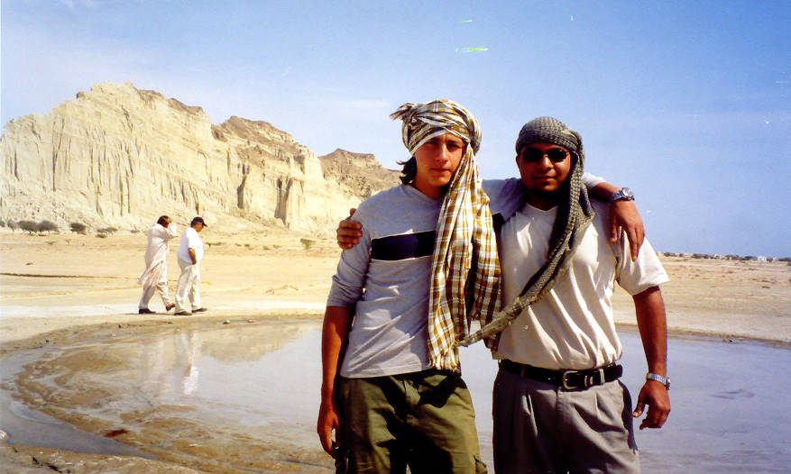

Yaseen and Sikander standing in front of a active mud spout.

## Comments (8)

**batul ali** - June 19, 2004 12:33 AM

how come you don't have more pix of the sea & the beaches in Gwadar? add them to the site if you have any.

---

**abid omar** - June 19, 2004 12:16 PM

Contrary to the caption, Yaseen and Sikander think they are at the �beach' in Gawadur.

---

**Yaseen** - June 23, 2004  2:45 AM

I never thought I was at the beach and neither did I suggest that I was!

---

**Dr. Ahmed** - June 23, 2004 11:17 AM

Dear Offroaders
hi
visited your website and was amazed to see what you guys have been upto. But let me say that it was really very irritatingly stupid of yours to put up specifications of your vehicles below your names. Guys, people want to know about you, not your vehicles. for pets sake take some professional advice and update your website. Keep up the ambition.
Regards

Ahmed

---

**Imad** - June 24, 2004  2:51 AM

Our club is called 4x4 Offroaders Club Karachi. Our website is called Offroadpakistan.com. I think it is quite obvious from these names that offroading is what we do and far out places is where we go. Jeeps are what brought the people in this club together. They are an integral part of it. Like it or not, we are a bunch of gearheads, not tea sipping vacationers. Otherwise, we would have been called Armchair Warriors Karachi and our website ExoticLocalesfortheJeeplessLoser.com. Go to the tech forums and articles and look at the number of people asking for advice on technical jeep related issues. Tell us then whether people are interested in jeeps or not. BTW, since you offered your "professional" advice, where is your website?

Have a nice day.

Imad

---

**sishah** - June 24, 2004  2:11 PM

I LOVE JEEPS. i dont know much about the mechanics involved, but for me, the aesthetics are good enough. i think what you guys are doing is amazing. there is just so much out there to learn about and discover, and what grander way to do it than in a jeep? what a power-trip!

---

**Imad** - June 24, 2004 11:52 PM

Actually, exploring the country in a jeep isn't much of a powertrip. Rather, it's an unparalleled feeling of freedom. The wind in your hair, the sun in your face, the guys in the slower jeeps eating your dust, the smack talking, the nagging of backseat passengers cramped between towering mountains of luggage :). What fun... it's like a big rolling party going from town to town.

---

**Raheel** - December 15, 2004  8:08 AM

The trips you have taken are great. The fact that you have made this website is outstanding and the name, 4x4 Offroaders Club Karachi is truly creative. These trips are cool because I've never been to all those places but if I ever wanted to go to those places I would choose none other than 4x4 Offroaders Club to plan and execute my journey. Keep up the good work. I think you should begin selling badges, memberships and other memorobilia in your shop.

P.S.: - Is the RSS feed for us? Is there freedom for all?

RESQJAX - CA, USA

---

