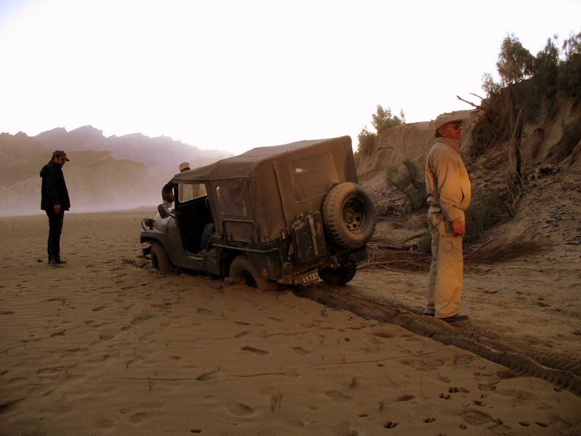

3rd Jeep to get stuck (CJ 5) - it needed to be winched out.: There are patches of 'khooba' (like quicksand) in the river bed. They appear dry on the surface, but sucks a Jeep right in. Usually it is difficult to tow the stuck vehicle out, as the tower will also get stuck, since there is barely enough traction to pull your own weight, without having to pull the weight of an additional vehicle.