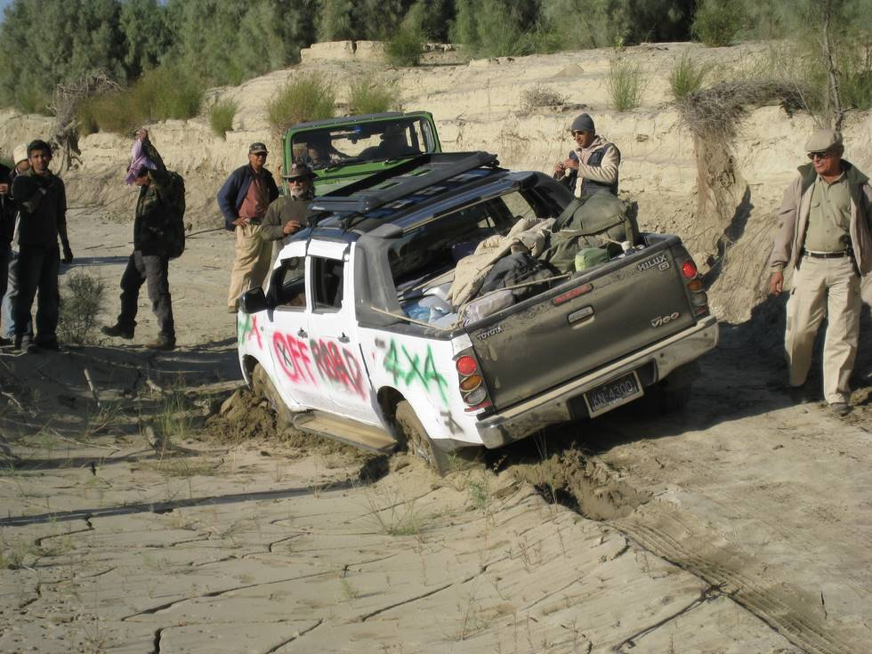

6th one to get stuck (Toyota Hilux Vigo).: This one kept geting stuck, everywhere, again and again. We had made bets, that for every 'stucking',' the driver would hand out a Pepsi to all those around. He had plenty, so he always got pulled out, though by t (ed: caption stuck?)

## Comments (4)

**Awab** - February 21, 2008  2:37 AM

ROTFL

YOUR HONOR I OBJECT.

Ill drag you all to the PEPSI court ... my vehicle took these hits to PROVIDE you ALL entertainment

LOL - it was a pleasure - next time you all might not be as lucky since im going to stock up lllow on the soda pops

**Faisal Khan** - March  2, 2008  6:22 PM

Doc! You surprise me... I did not know you had a 4x4 :)

**sajidd** - March  6, 2008  9:45 PM

was it the vehicle that had limited off road capabilities or was it the driver?

**Teeth Maestro** - March 24, 2008  5:45 PM

Sajid - the passage was tight, and the wider wheel base of Vigo landed me into the 'gup' and once the front tire got entrapped it sucked the entire car to the left. observe the tire tracks (specially the front tier). and see how far it slid away. Though I could have been closer to the sidewall and but may have miscalculated the leading edge to the quick sand. But heck it was fun...

