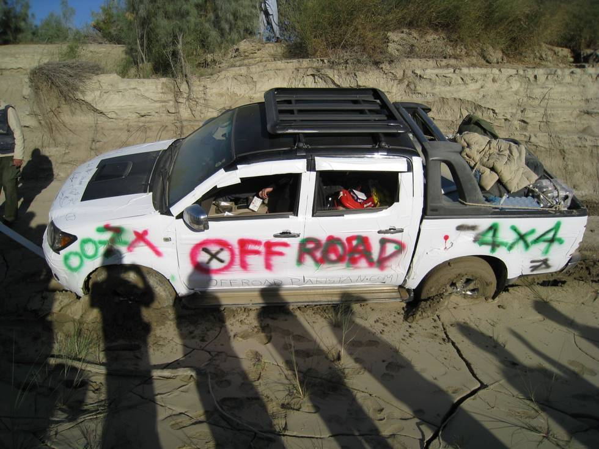

## Comments (3)

**sajidd** - March  6, 2008  9:46 PM

damn..getting this baby out of this mess must have been hard?

---

**Teeth Maestro** - March 24, 2008  5:46 PM

this baby purred out like a baby ;)

---

**Shahzad Hassan jaffar** - April 20, 2008 10:59 PM

Well its not the fault of Vigo but less expertise of the driver. I belong to Quetta and every one knows that Baluchistan is best place for off roading. I have a 2500 cc Vigo but it has never got stuck somewhere. vigo is a light vehicle and the engine is a 2kd so it needs alot of power in desert or mountain. SO in every off road drive one must not put the vehicle in much 1 or 2 gear but must go for 2 3 4 and not more than that and remember auto vigo is not successful in off roading try to drive manual

---

