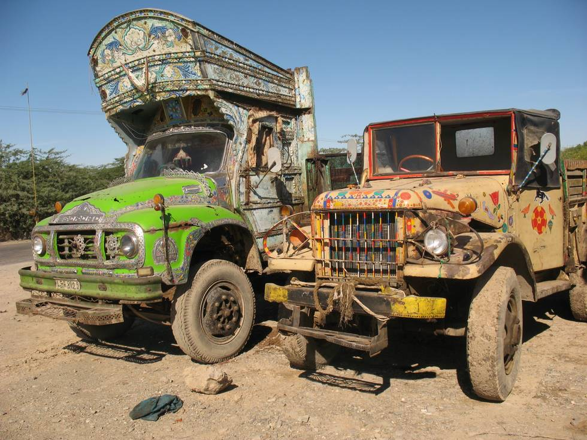

An old Dodge Powerwagon from World War era, still in use:

## Comments (1)

**Arkaprava Datta** - September 26, 2008  5:43 PM

Thats the Japanese cousin of the Dodge Weapon Carrier.

What you see on the right is a TOYOTA FQ15, based on the Dodge M37 Weapon Carrier.

I have the INIDIAN built Nissan version of the same, know as the Nissan 4W73 or 1Ton.

Regards,

Arka

