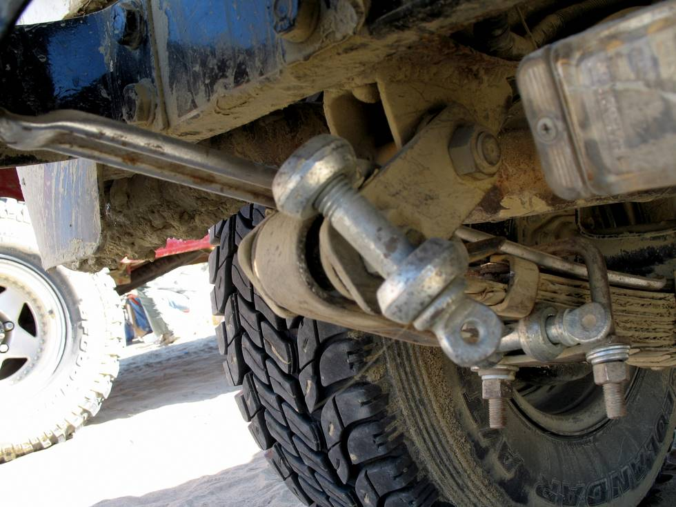

Withstood sand, mud, boulders, steep inclines and more, and a few days of Karachi driving as well! We used a Allora tyre lever in place of the two main broken leafsprings, tied it in place with a U-clamp, used a couple of D shackles from a towstrap as spaces to stop the tyre lever from moving about too much, then set off once again.

## Comments (1)

**Hasaan** - January 18, 2009  5:34 PM

Guys.
as a jeep/ offroad lover ( read fanatic) and now too much involved in professional work , I litrellary spent 3 hours going thru your exotic randevous . Simply put . U guys are swell . Above was the topped view( it pays to have original Allora tools in ur kit) . Keep it up as u have now motivated me to again make a jeep ( well I will go for a original cherokee or a CJ -7 this time as soon as i get hold of a good one . (9 yrs ago I had a Cj -5 ,4 cyl ( bought for 70 k frm Khi) which was most of the time being ( in-house)repaired in my garage or had little diesel as I used to have educational stipend of 3k and all my scholarships used to go into buying second hand bearings, seals , battery and used tyres to keep my "billo " running.)
take care and keep on enjoying
rgds

---

