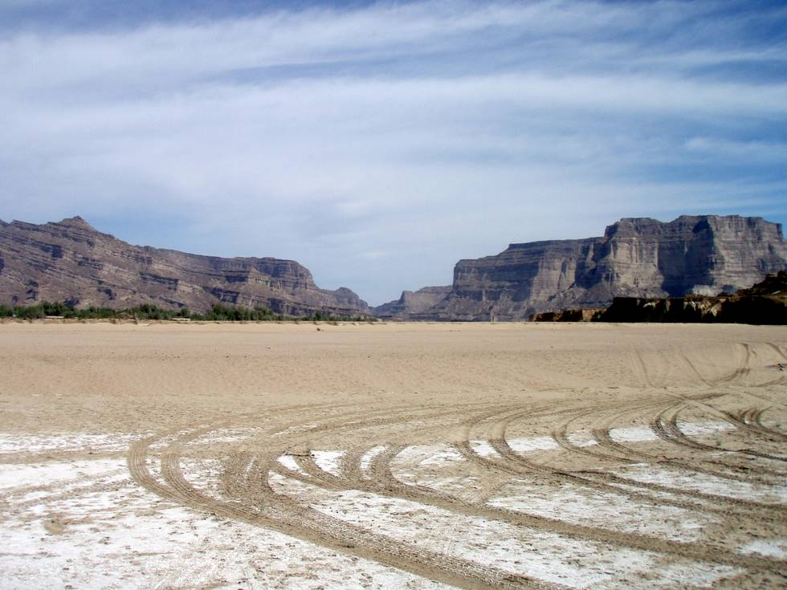

## Comments (1)

**Muaricio** - April 28, 2012  2:55 PM

Juhuuu, hab mir eure Fotos mal durchgeschaut und bin sehr bedrceiunkt von den Landschaften, We4ldern, Tieren etc. und der Qualite4t eurer Kamera!Ach wie schf6n es da bei euch ist!!!Krass, dass ihr ne Vogelspinne gesehen habt *ahhhh*Die Bilder vom Sonnenuntergang im Parque Nacional Huerquehue und besonders das IMG_1399 gefe4llt mir ganz doll!Viel Spadf beim Vogel-Projekt und bis ganz bald!!PS: Is sau komisch euch auf den Bildern zu sehen, irgendwie hab ichb4s noch gar nicht recht gerafft, dass ihr dort seit =D

---

