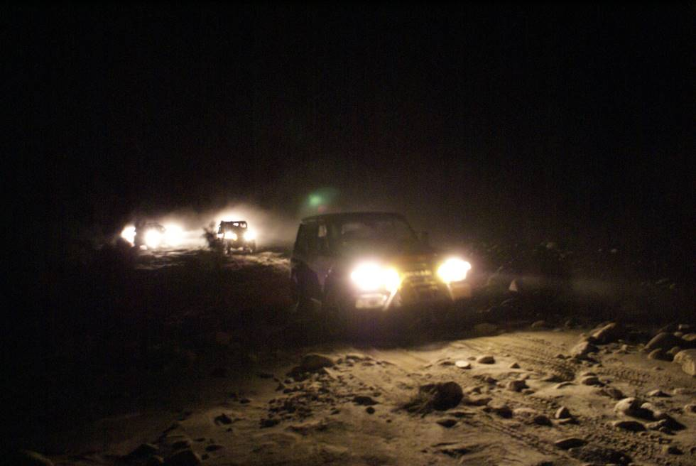

Offroading at night. The vehicles are staying within visual range of each other, because if you lose the track, then you are truly lost.:

## Comments (1)

**Presilya** - April 28, 2012  9:48 PM

If my daughter ever retcaed in that manner to a gift from someone she would be in a whole world of trouble. She's fully aware that people are not required to give her gifts, so she should be grateful for every gift she is given, whether its something she wants more than anything, or a pair of socks.

