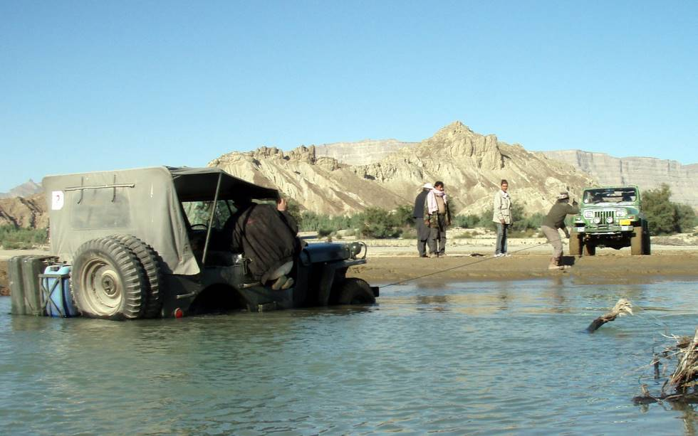

The 4th Jeep (actually the Ford version from the 2nd World War era) to get stuck or nearly drowned!: Not the very experienced driver's fault, he was following the local guide's advice. That's what happens when you are first up front and finding the route.