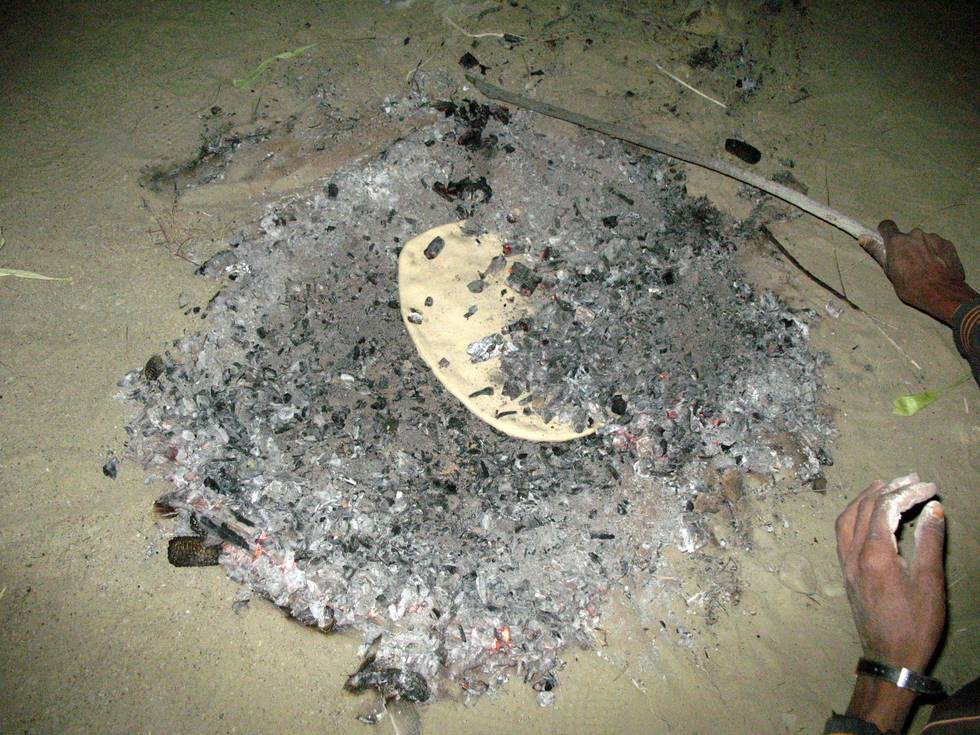

When the locals travel, they have no utensils or cutlery. They made a 'roti' (flat bread) on a stone, and place it within the embers of a fire to bake. The roti comes out better than what you can prepare on a stove.: