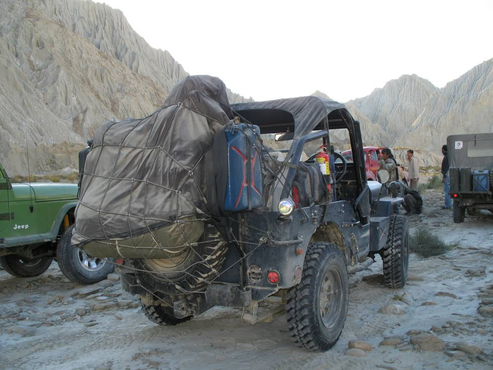

rebuilt by Atif in Karachi, on its first trip with the 4X4 Offroaders Club Karachi.

## Comments (1)

**Mariam Kamil** - February 16, 2008 12:12 AM

just wanted to make a correction...this jeep's owner in ATIF SHAHZAD of Karachi and the jeep was rebuilt in KARACHI only.

---

