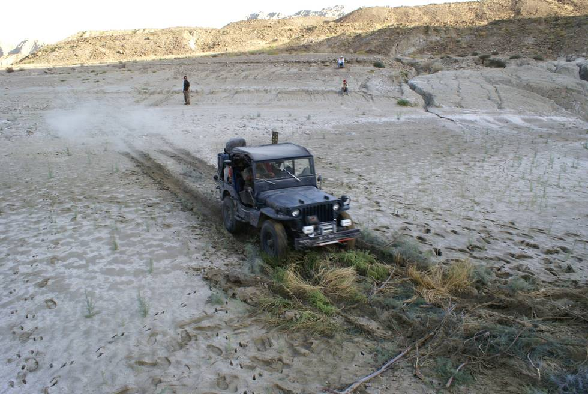

Zooming across over another marshy bit of 'naala' (stream crossing). A week before this, there was a brief shower of winter rains, so places of the otherwise dry river bed became marshy.:

## Comments (1)

**Suresh** - April 28, 2012 11:29 PM

Ah, yes, that familiar Kon-ka-reeeee! They have been cnalilg pretty much non-stop since the beginning of March. They have been coming to our feeder every day, despite the efforts of our mockingbird to chase them away. Spring is near!

