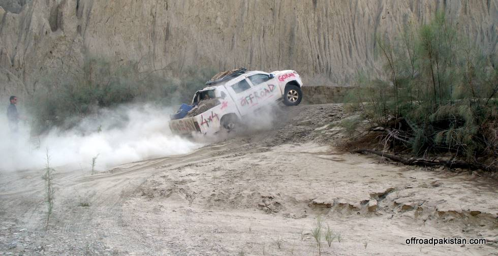

Awab powering his way up a sandy incline, while Asim who had been directing him eats dust.:

## Comments (8)

**KAMRAN TALPUR** - December 17, 2008  2:01 PM

ZOR LAGAO, ZOR LAGAO

---

**Rashid Younus** - December 19, 2008 11:56 AM

Why do you guys use a lot of throttle? it appears that the same climb could be easily managed without throwing up sooo much dust :) Just an observation indeed you are actually there and know the terrain and the climb better :)

---

**KO** - December 19, 2008  6:16 PM

He got stuck here... the poor guy eating dust behind was trying to direct him.

There is hardly any traction on the soft silty sand, so even a bit of throttle leads to wheelspin and getting stuck.

---

**Hamid Omar** - December 19, 2008  7:45 PM

Throwing up dust good for taking pictures! Awab made it up on his 5th attempt - he tried going up at different speeds!

---

**Adeel** - December 21, 2008 11:15 AM

KO is right, there is no traction due to the soft sand and it is a long wheel base truck that makes even difficult for it to climb. But the poor guy eating dust is standing at a very wrong spot to navigate the driver :-)

---

**KO** - December 21, 2008 12:21 PM

First Awab got stuck where Asim was standing - so after he got unstuck from there he just went straight ahead, not giving the poor guy a chance to get away from the dust shower!

---

**fj** - January  3, 2009  3:56 PM

guys believe me that climb is nothing for this car if it's engaged in 4H with reduced tire pressure upto 16-18 lbs. easy peazy :)

---

**Yaseen** - January  4, 2009  2:24 AM

This area has lots of different terrain; rocks, gravel, mud and soft sand. So, one can't deflate and inflate tires all day. Therefore you have to try the best possible approach and in the process throw up sand, make people eat sand and get good pictures!

---

