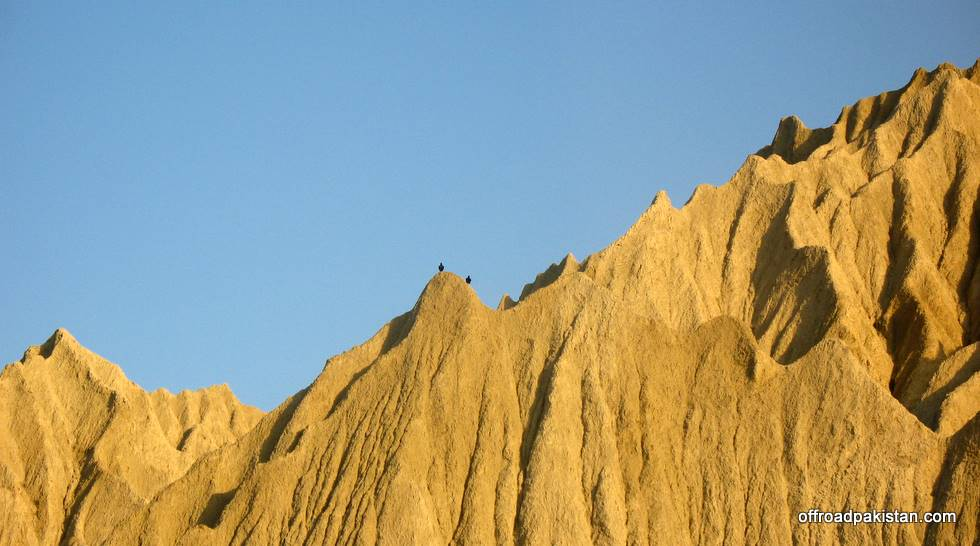

## Comments (1)

**KAMRAN TALPUR** - December 17, 2008  2:04 PM

I THINK THESE MUST BE SEDIMENTARY ROCK BECAUSE THESE CONSIST OF MUD. THERE MIGHT HAVE BEEN GREAT CHANGES ON THE MOUNTAINS OVER MILLIONS OF YEARS. CAN ANY GEOGRAPHY/GEOLOGY SPECILIST CAN PLEASE COMMENT MORE AND INFORM ME.

---

