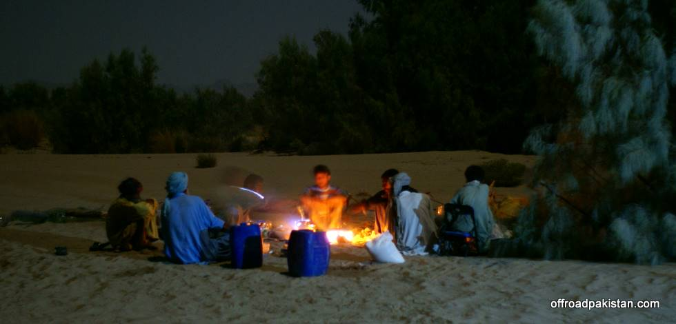

## Comments (5)

**Adeel** - November 19, 2008  2:45 PM

How many guides were there btw. And how did they travel with the convoy???

**KO** - November 19, 2008  3:02 PM

The real guides were us, guided by GPS and Google Earth... We had about 4 locals with us altogether. We arrange before hand to have enough car space with us to fit all the guides. A couple of villagers from nearby had dropped in also to the campsite.

**Adeel** - November 20, 2008 11:02 AM

Hi KO,
Check out this site. It'll help u in planning ur next trips hopefully.
<http://itouchmap.com/latlong.html>

**KO** - November 20, 2008  2:08 PM

Thanks Adeel - though Google Earth tells u that information also.

**Adeel** - November 20, 2008  6:11 PM

I know, but I found this one more/better accurate as compared to google earth that is OFF by miles sometimes.

