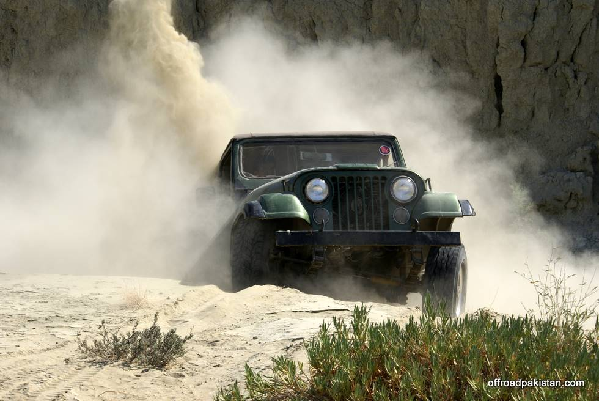

The newset entrant in the club, Faraz's CJ7.:

## Comments (6)

**Adeel** - November 19, 2008  2:47 PM

Beautiful pic

**Teeth Maestro** - November 19, 2008  4:18 PM

Damn good pic Faraz !!!

well done MO

**Faraz** - November 20, 2008 10:01 AM

Thanks!. Guess the 500 man hours i spent fixing the suspension seems to have paid off. Though now there is so much articulation i can almost still here the drivers side tire go 'khhhhhrrrrrrrrr' against the tire well :) Thinking am just gonna remove the fenders or something!

**KO** - November 20, 2008 10:17 AM

Articulation is good, and it's just a fender, a little bump now and than won't hurt it. I think a half inch or 3/4 inch spacer in the spring pack should fix the fender bumping issue up front.

**HAMID omar** - December 14, 2008  5:44 AM

it's not the Jeep, nor the driver - it's the GUY who took the picture!! Pl post comments on the PICTURE TAKER's expertise!!!! Catching the moment on camera is not easy!!!! Needs 40 years experience!! Wonder WHO is this super picture taker?!?!!!

**Adeel** - December 14, 2008 11:13 AM

thats true ;-) jeeps gonna come up somehow but who has frozen the moment.

