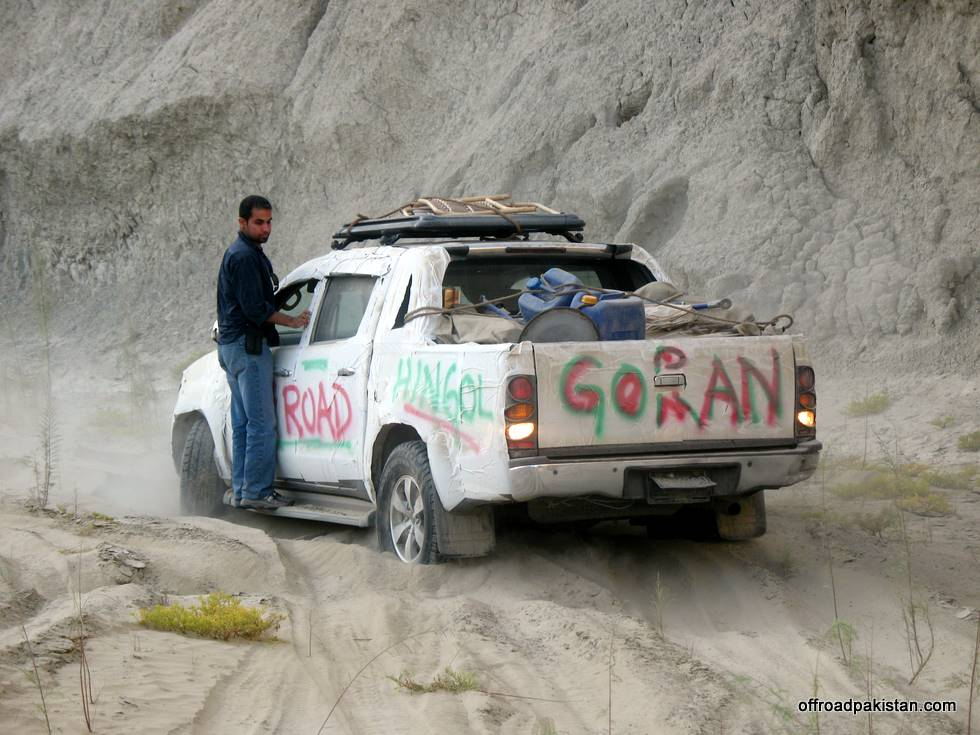

vehicles at tail end find the going more tough as the mud gets softer with each vehicle gone ahead

## Comments (2)

**Adeel** - November 19, 2008  2:31 PM

Beaten sand track is always difficult to drive on.

**fj** - January  3, 2009  3:59 PM

live car abuse show :D

