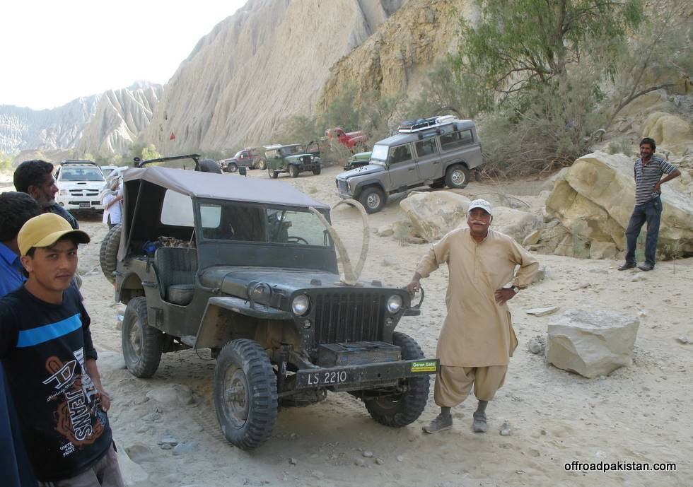

& the Ibex horns he found at the base of Goran Mountain.

## Comments (1)

**KAMRAN TALPUR** - December 17, 2008  1:53 PM

WHAT A SPLENDID SIGHT THIS IS. THIS IS INFACT UNIQUE PLACE TO VISIT. MAY WE ALL ONE DAY BE ABLE TO EXPLORE THE GRANDEUR OF THIS MAJESTIC PARK. IT IS MUST SEE PLACE FOR ALL NATURE LOVERS.

---

