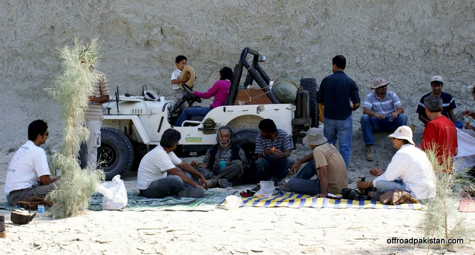

## Comments (10)

**Adeel** - November 20, 2008  1:26 PM

How many younger kids accompanied on this trip?? The young fellow on the jeep seems to be very happy and enjoying the hectic trip.

---

**KO** - November 20, 2008  2:06 PM

The young fellow probably enjoyed the trip the most! This time around there was just him, but back in March there were 5-6 kids under 10.

---

**Adeel** - November 20, 2008  6:15 PM

Hes a great chap, and its good to know that u guys take kids along. Many a times, in our offroading trips my son (now 11) is the only one to join. He accompanied me to the Liwa Desert (where the UAE Desert Challenge took place) for a pure offroad trip just a few weeks back.

---

**hamid omar** - December 14, 2008  5:14 AM

When Khalid Omar was 8 yrs old (probably even younger) - he's been going on Jeep trips/camping! All kids should go - it's one of the very healthy activity possible!

---

**Adeel** - December 14, 2008 11:06 AM

I completely agree with you. Instead of taking kids to the malls and only for indoor games, v rather take them out for real life experiences. My kids go out with me all the time for offroading and camping and they love it.

---

**Adeel** - December 14, 2008 11:08 AM

I completely agree with you. Instead of taking kids to the malls and only for indoor games, v rather take them out for real life experiences. My kids go out with me all the time for offroading and camping and they love it. My kids had their first camping outing when they were a few months old only and since then there has been no stop to it.

---

**Adeel** - December 14, 2008 11:10 AM

Sorry for putting partial msg twice due to network error.

---

**Sarmad** - February 23, 2009  1:57 PM

Seems like an awesome trip. How many jeeps ran on petrol or was it all diesel power ?

---

**Syed Hasan Shahid Bukhari** - May  1, 2009 11:34 AM

Thank You.

---

**Khurram Shahzad** - November  4, 2009 10:05 PM

I have seen and enjoyed all the pictures here on the site regarding Goran Gatti, its amazing and thrilling.
this is an excellent job done by the club members. they not only enjoyed there time but they put this on web which every one will come to know around the globe.
well done

---

